## 概念

### 智能体 

基于对话的AI项目，它通过对话方式接收用户的输入，由大模型自动调用插件或工作流等方式执行用户指定的业务流程，并生成最终的回复。智能客服、虚拟伴侣、个人助理、英语外教都是智能体的典型应用场景

### 插件

插件是一个工具集，一个插件内可以包含一个或多个工具（API）

### 工作流（Workfiow）

用于处理功能类的请求，可通过顺序执行一系列节点实现某个功能。适合数据的自动化处理场景，例如生成行业调研报告、生成一张海报、制作绘本等

### 知识库：

知识库功能包含两个能力，一是存储和管理外部数据的能力，二是增强检索的能力

[0-1搭建智能体](https://mp.weixin.qq.com/s/GBIPm1ndjW_aDPGLxe1_HA)

训练->部署大模型-> 推理

## 微调

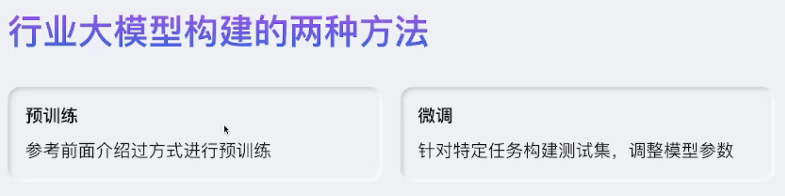

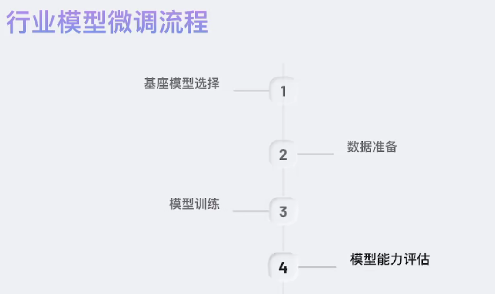

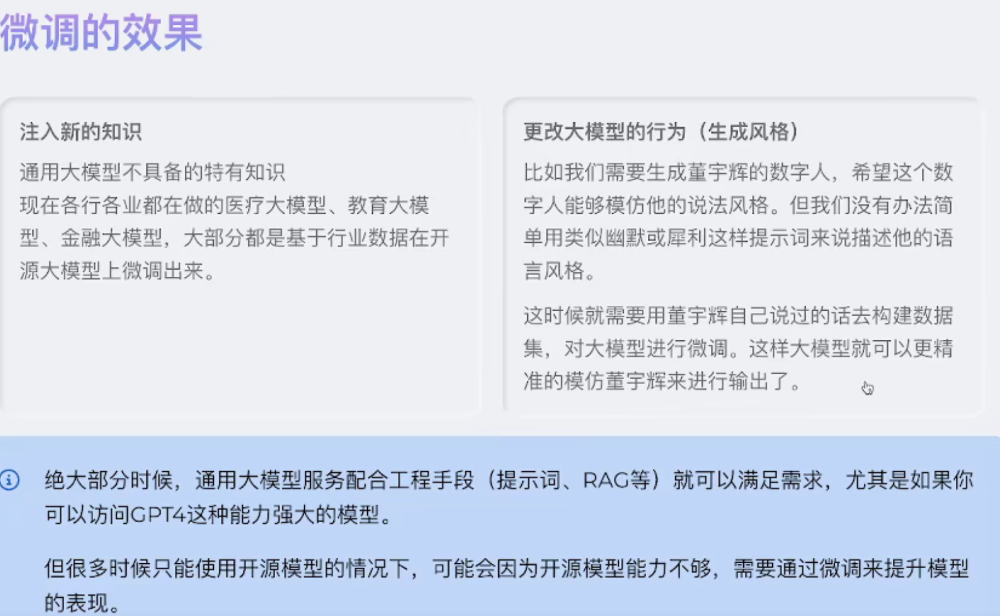

**过拟合：** 模型在训练数据上表现得非常好，但在新数据（测试集、实际应用场景）上表现很差。  

缺点：

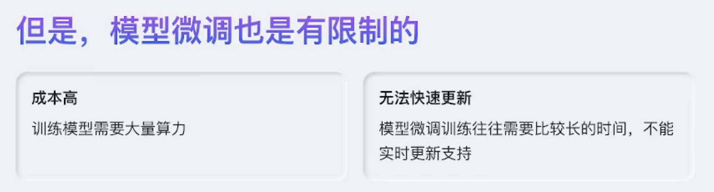

## RAG

与微调的区别：微调会改变模型文件，rag不会

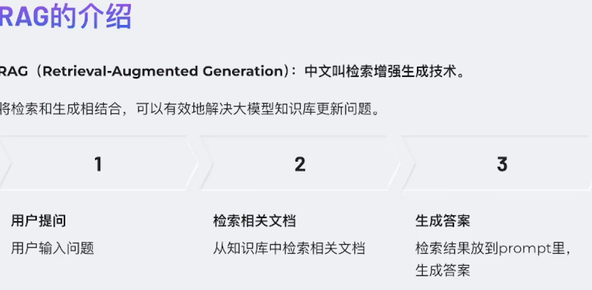

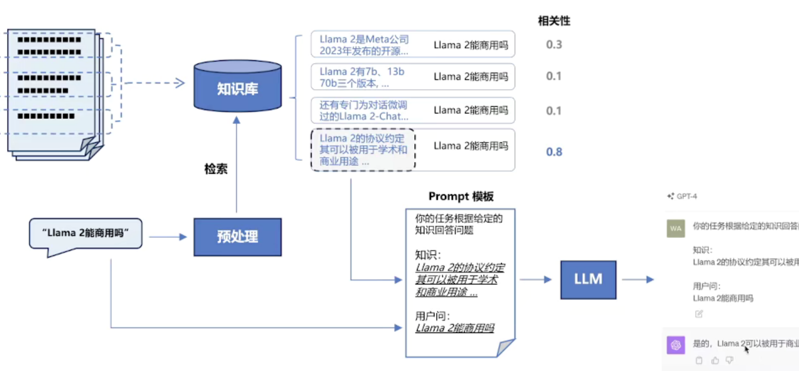

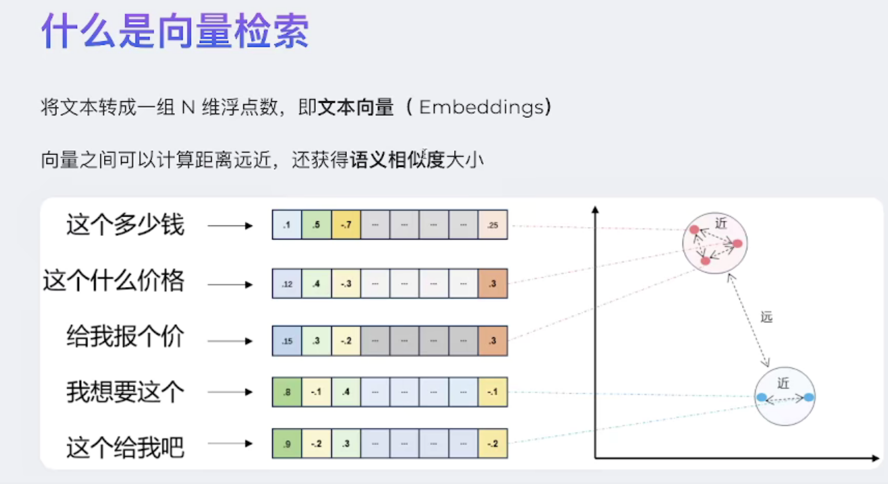

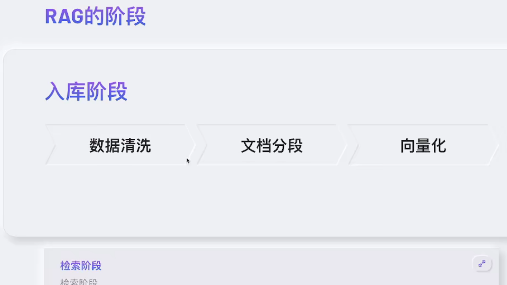

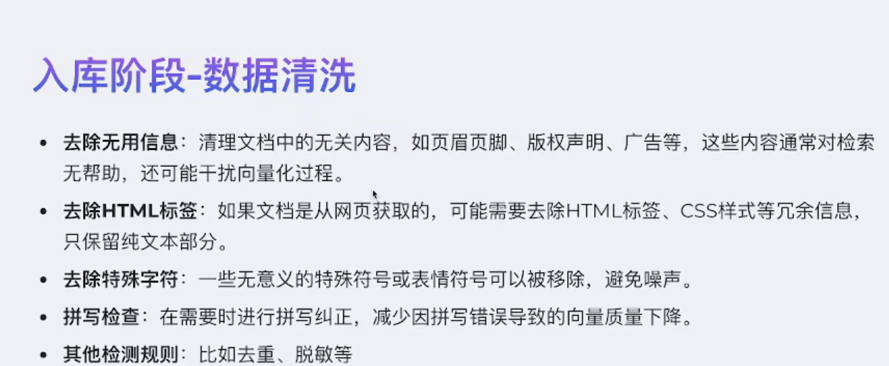

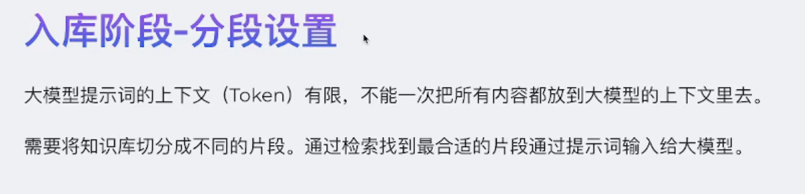

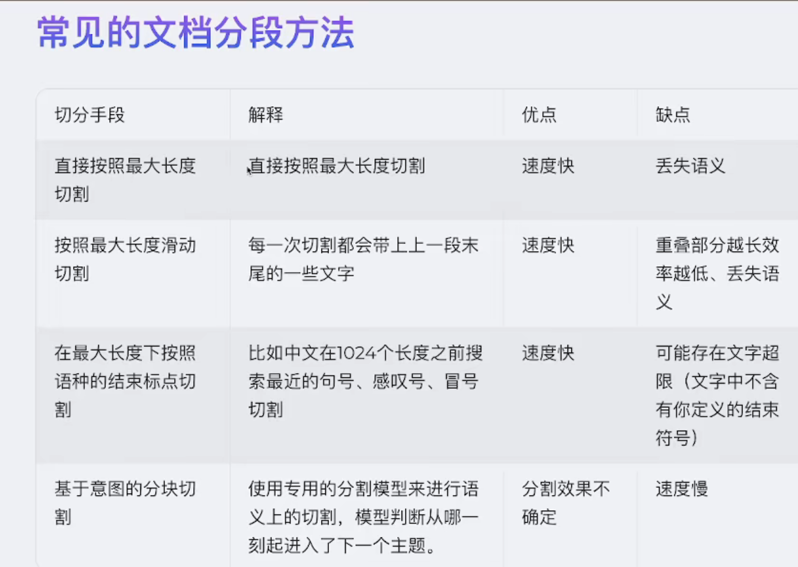

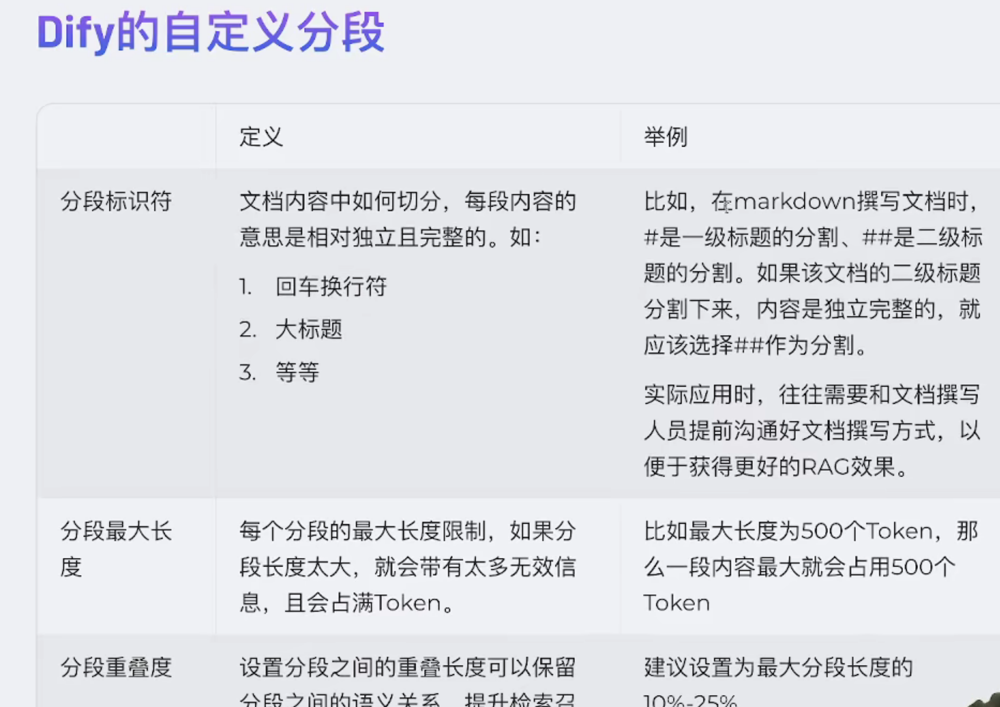

RAG 的检索流程
<ol class="ne-ol" style="margin: 0; padding-left: 23px"><li id="u5796c80e" data-lake-index-type="0"><strong>向量化</strong></li></ol><ul class="ne-list-wrap" style="margin: 0; padding-left: 23px; list-style: none"><ul ne-level="1" class="ne-ul" style="margin: 0; padding-left: 23px; list-style: circle"><li id="u9514f853" data-lake-index-type="0">把用户的问题（query）通过 <strong>向量模型</strong>（比如 Sentence-BERT，或者更强的 embedding 模型）转成一个向量。</li><li id="ueacd0c08" data-lake-index-type="0">把知识库里的文档也提前分片、向量化，存到一个 <strong>向量数据库</strong>（如 FAISS、Milvus、Pinecone）中。</li></ul></ul><ol start="2" class="ne-ol" style="margin: 0; padding-left: 23px"><li id="ue3f905a3" data-lake-index-type="0"><strong>相似度检索</strong></li></ol><ul class="ne-list-wrap" style="margin: 0; padding-left: 23px; list-style: none"><ul ne-level="1" class="ne-ul" style="margin: 0; padding-left: 23px; list-style: circle"><li id="uccb7ca72" data-lake-index-type="0">在向量数据库里，用余弦相似度、点积、欧式距离等方法，找到和 query 最接近的向量（对应的文档片段）。</li><li id="u85750270" data-lake-index-type="0">这个过程就是“检索”。</li></ul></ul><ol start="3" class="ne-ol" style="margin: 0; padding-left: 23px"><li id="u1042fbaf" data-lake-index-type="0"><strong>召回结果</strong></li></ol><ul class="ne-list-wrap" style="margin: 0; padding-left: 23px; list-style: none"><ul ne-level="1" class="ne-ul" style="margin: 0; padding-left: 23px; list-style: circle"><li id="u4f0379f9" data-lake-index-type="0">把最相关的文档片段（比如 top-k 个）作为“召回结果”返回。</li><li id="uf67e5d6f" data-lake-index-type="0">有时会再做 <strong>重排序（Re-ranking）</strong>，保证真正相关的内容排前面。</li></ul></ul><ol start="4" class="ne-ol" style="margin: 0; padding-left: 23px"><li id="uaf1fe6b3" data-lake-index-type="0"><strong>增强生成</strong></li></ol><ul class="ne-list-wrap" style="margin: 0; padding-left: 23px; list-style: none"><ul ne-level="1" class="ne-ul" style="margin: 0; padding-left: 23px; list-style: circle"><li id="u63563be4" data-lake-index-type="0">把召回到的内容塞到 prompt 里，和用户问题一起喂给大模型，让模型基于检索结果来生成回答。</li></ul></ul>

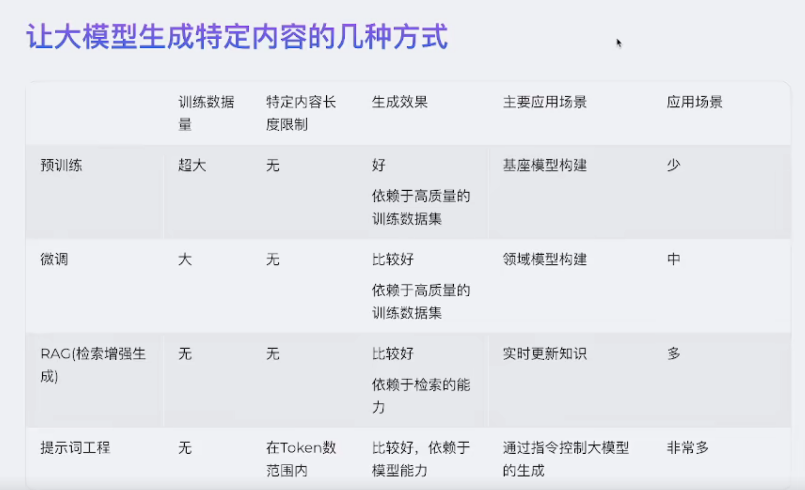

嵌入模型

指 <strong>Embedding Model</strong>，主要用来把文本、图片、音频等数据转换成<strong>向量表示</strong>（一串高维数字），让计算机能理解并处理这些非结构化数据。

简单理解：
<ul class="ne-ul" style="margin: 0; padding-left: 23px"><li id="u2b7af42a" data-lake-index-type="0">传统计算机只能处理数字。</li><li id="ua99c9722" data-lake-index-type="0">自然语言（文字）、图像、语音等都需要转化成“向量”，才能进行计算。</li><li id="uf4b5bf6c" data-lake-index-type="0"><strong>嵌入模型的作用就是把复杂的信息转成向量，并且让相似的内容在向量空间中“靠近”。</strong></li></ul>

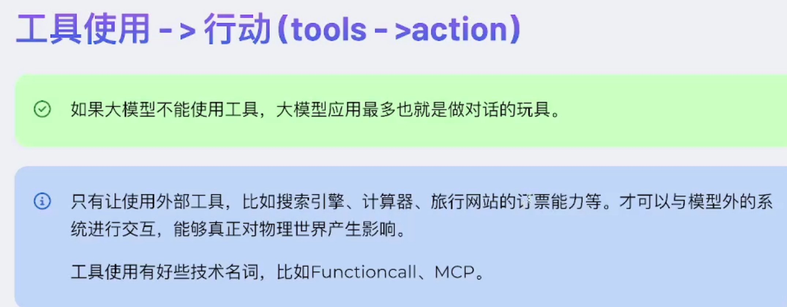