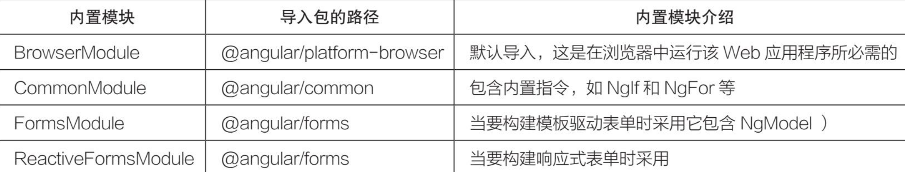
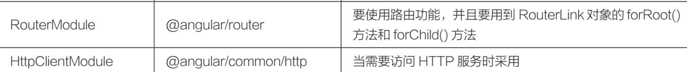

## 版本 

​		2016年9月，谷歌公司发布了Angular 2。它是由AngularJS的同一个开发团队完全重写Angular JS而成的，与网络日益现代的需求相匹配。现在人们常说的Angular（后面没有JS）泛指Angular 2之后的Angular。

## 核心概念

1. 服务

​		 Angular把组件和服务区分开，以增强模块性和复用性。通过把组件中和视图有关的功能与其他类型的功能分开，组件变得更加精简、高效。在功能方面，组件聚焦于展示数据，把数据访问的职责委托给某个服务。因此服务是实现单一目的的业务逻辑单元，它封装了某一特定功能，如从服务器获取数据、验证用户输入或直接往控制台中写日志等。服务是可以通过注入的方式供用户使用的独立模块。

2. 依赖注入

​		依赖注入其实不是Angular独有的概念，这是一个已经存在很长时间的设计模式，也可以叫作控制反转（Inverse of Control）。熟悉Java和.NET的用户对这种设计模式不会感到陌生，Java的Spring框架里的IOC就是一种这样的设计模式。Angular也提供了依赖注入。因为组件是用TypeScript写的类，所以依赖关系通常通过构造函数注入。在Angular中，我们可以创建一个可重用的软件对象来处理与服务器的通信，通过构造函数将它注入每个需要它的对象（类）。

3. 指令

​		Angular的模板是动态的。当Angular渲染它们时，Angular会根据指令对DOM进行修改。
   Angular中包含以下3种类型的指令。
- 属性指令：以元素的属性形式来使用的指令。

- 结构指令：用来改变DOM树的结构的指令。

- 组件指令：作为指令的一个重要子类，组件本质上可以看作一个带有模板的指令。

4. 管道

   Angular的管道的作用是把数据作为输入，然后转换它，给出期望的输出。
   常见的管道有：日期管道，负责转换日期为友好的本地格式；货币管道，负责转换货币格式；异步管道，可实时订阅数据；等等。

5. 模块

   Angular的模块的作用是把组件、指令、服务等打包成内聚的功能块，封装或暴露相应的功能，从而达到模块间的解耦，是高度自治的一种程序设计模式。换句话说，模块对应的是业务和功能，组件对应的才是页面展示和交互。

## Angular CLI常用命令

创建命令的格式为ng generate `<type>` [options]，可以简写为ng g `<type>`[options]


### 项目的启动过程
   Angular项目的启动过程分为以下几步。
  1. 当在终端执行ng serve命令时, Angular CLI会根据angular.json文件中的main元素找到项目的入口文件main.ts。
  2. main.ts文件加载AppModule根模块（app.module.ts文件）。
  3. AppModule根模块引导AppComponent根组件（app.component.ts文件）。
  4. AppComponent根组件完成自身的初始化工作，如完成标签`<app-root>`的初始化工作。

## Angular组件详解

###  	什么是Angular组件
​	 Angular组件对应的是Component类的文件，默认情况下，它是使用TypeScript编写的，在组件中绑定了模板和样式，组件控制着模板中的元素，如视图显示和触发事件等。用户在Component类中定义组件的应用逻辑，为视图提供支持。组件通过一些由属性和方法组成的API与视图交互。所有使用Angular开发的Web应用程序都有一个根组件，根组件通常被称为App组件，App组件下可以存在若干个子组件。Angular为组件提供了相互传递数据和响应彼此事件的方法。本书后续章节将会介绍组件的输入和输出。组件被设计为自包含且松散耦合的结构，每个组件都包含有关自身的数据，举例如下。

- 它需要什么输入数据。

- 它可能向外界发射的事件。

- 如何展示自己。

- 它的依赖性是什么。

通常，每个组件由3个文件组成：模板（Template）文件、类（TypeScript）文件和样式（CSS）文件。默认情况下，Angular中已经有了一个应用程序（App）组件。

###  	组件模板的种类

​		 Angular中的组件模板就是MVVM模式中的V，它扮演的是一个视图的角色，简单来说就是展示给用户看的部分。组件模板包含用于在浏览器中显示组件的标记代码，组件通过@Component()装饰器把组件类和模板关联在一起。

Angular组件类中有两种方法为组件指定渲染模板。组件模板主要分为内联模板和外部模板。
1. 内联模板
​		@Component()装饰器中的template属性可直接指定内联模板。


template属性的值是用反引号“`”引用的一个多行字符串，这个多行字符串是标准的HTML代码。

2.  外部模板​		@Component()装饰器中的templateUrl属性可引用外部模板。


templateUrl属性的值是模板文件的URL，上述代码表示引用的是当前目录下的app.component.html文件。

至于是选择内联模板还是外部模板，并没有绝对的依据，用户根据自己的实际情况来选择即可。内联模板能减少文件量，适合模板内容简单、代码量少的场景。

###  组件类的构成
Angular中的组件类就是MVVM模式中的VM（ViewModel，视图模型），ViewModel是View和Model的结合体，负责View和Model的交互和协作。组件类的作用是控制模板渲染。

Angular中用@Component()装饰器声明组件类，@Component()装饰器会指出紧随其后的类是组件类，并告知Angular如何处理这个组件类。该装饰器包含多个属性，这些属性及其值称为元数据。元数据告诉Angular到哪里获取它需要的主要信息，以创建和展示这个组件类及其视图

1. @Component()装饰器的其他元数据配置选项


2. 属性绑定

- Class样式绑定

  

- Style样式绑定

  

- DOM属性绑定

​		 DOM属性绑定指通过方括号“[]”将模板视图中的DOM属性与组件类中的属性进行绑定，形如[DOM属性]="组件类中的属性"。如，

- HTML特性绑定

​		HTML特性绑定的语法类似于DOM属性绑定，但其方括号之间不是元素的DOM属性，而是由前缀 attr. 和HTML特性名称 组成的字符串，形如[attr.HTML特性名称]。

### 组件的生命周期


### 父子组件的交互

1. @Input()装饰器：父组件传递数据到子组件。

2. @Output()装饰器：子组件传递数据到父组件

   子组件暴露一个EventEmitter对象，当事件发生时，子组件利用该对象的emits()方法对外发射事件。父组件绑定到这个事件，并在事件发生时做出回应。

   

### 模板表达式

​	管道运算符

使用“|”分隔模板表达式和管道函数，它会把左侧的模板表达式结果传给右侧的管道函数。


### 模板语句

​	


### 模板引用

​	模板引用用来从模板视图中获取匹配的元素，这些元素可以是一个或多个

1. 模板引用变量

   

   

2.  @ViewChild()装饰器

​		@ViewChild()装饰器是由Angular提供的属性装饰器，用来从模板视图中获取匹配的元素，返回匹配的一个或首个元素。

​	使用@ViewChild()装饰器时需注意：查询视图元素的工作在组件的生命周期AfterViewInit开始时完成，因此在ngAfterViewInit()方法中能正确获取查询的元素

```ts
import {
  Component, AfterViewInit, ViewChild, AfterContentInit,
  OnInit, ElementRef, AfterViewChecked
} from '@angular/core';

@Component({
 selector: 'app-root',
 template: `
   <h1>Welcome to Angular World</h1>
   <p #title1>Hi {{ name }}</p>
   <p #title2>Hello {{ name }}</p>
 `,
 styles: []
})
export class AppComponent implements OnInit, AfterContentInit, AfterViewInit,
  AfterViewChecked {

  name: string = 'Murphy';

  @ViewChild('title1', { static: false })
  ctitle1: ElementRef;

  @ViewChild('title2', { static: true })
  ctitle2: ElementRef;

  // 方法1
  ngOnInit() {
   console.log('ctitle1 in ngOnInit : ' + this.getTitleValue(this.ctitle1))
   console.log('ctitle2 in ngOnInit : ' + this.getTitleValue(this.ctitle2))
  }

  // 方法2
  ngAfterContentInit() {
   console.log('ctitle1 in ngAfterContentInit : ' + this.getTitleValue(this.ctitle1))
   console.log('ctitle2 in ngAfterContentInit : ' + this.getTitleValue(this.ctitle2))
  }

  // 方法3
  ngAfterViewInit() {
   console.log('ctitle1 in ngAfterViewInit : ' + this.getTitleValue(this.ctitle1))
   console.log('ctitle2 in ngAfterViewInit : ' + this.getTitleValue(this.ctitle2))
  }

  // 方法4
  ngAfterViewChecked() {
   console.log('ctitle1 in ngAfterViewChecked : ' + this.getTitleValue(this.ctitle1))
   console.log('ctitle2 in ngAfterViewChecked : ' + this.getTitleValue(this.ctitle2))
  }

  // 如果传入的元素不为空，则输出该元素的文本内容
  getTitleValue(v: ElementRef) {
   return v ? v.nativeElement.innerHTML : v
  }
}
```


（1）模板中定义了两个模板变量title1和title2，同时在类中定义了两个类属性变量ctitle1和ctitle2，用@ViewChild()装饰器分别引用两个模板变量，注意为它们提供了不同的static值。

（2）模板中`<p>`标签的内容由静态字符串和动态插值表达式组成；Hello和Hi是静态字符串，插值表达式{{name}}是动态的，它的值来自组件类。

（3）组件类一共实现了4个生命周期接口，每个生命周期接口的回调方法尝试获取类属性变量引用的信息，并且在控制台中分别输出。

（4）4个生命周期接口的回调方法发生的顺序是ngOnInit()、ngAfterContentInit()、ngAfterViewInit()、ngAfterViewChecked()。

（5）无论static值为true还是false，在组件的生命周期AfterViewInit发生之后，@ViewChild()装饰器都能获取到HTML元素中的内容，因此在方法3和方法4中能输出HTML元素中的内容。

（6）当static值为true时，@ViewChild()装饰器可以获取HTML元素中的静态内容，因此在方法1和方法2中获取的ctitle2的值为Hello。

（7）当static值为false时，在组件的生命周期AfterViewInit发生前，@ViewChild()装饰器获取不到任何内容，因此在方法1和方法2中ctitle1的输出值为undefined。

3.  @ViewChildren()装饰器

​		与@ViewChild()装饰器一样，用来从模板视图中获取匹配的元素，不同的是返回匹配的所有元素。

```ts
@ViewChildren('title1, title2')
ctitles: ElementRef[];
```


### $event模板变量

```ts
<!-- 访问模板变量 $event， $event.target.value返回当前控件（input）value属性的值-->
1.<input (change)="updateName($event.target.value)"/>

<!-- 与上面的结果一致。先声明一个模板变量#name，然后引用它的value属性的值 -->
2.<input #name (change)="updateName(name.value)"/>

<!-- 调用多个方法示例 -->
3.<input (keyUp)="updateName($event.target.value); validate()"/>
```


### 双向数据绑定


**自定义NgModel**

```ts
//子组件.html
<div>大小：{{size}}</div>
<button (click)="handleSizeChange()">尺寸改变</button>
//子组件.ts
@Input()
  size: number = 0;

@Output()
  sizeChange = new EventEmitter<number>();

handleSizeChange() {
    this.sizeChange.emit(Math.random()*10);
}
//父组件引用
<app-test  [(size)]="size"></app-test>

```

`注意: 变量名称x和xChange中的x仅是一个标识，可以替换为任何有效的变量名`

## 指令

​	指令是DOM元素上的标记（如属性），它告诉Angular要将指定的行为附加到现有DOM元素。指令的核心是一个**函数**，只要Angular编译器在DOM元素中找到指令，该指令就执行。

​	这些指令可以通过添加和删除视图DOM元素来更改DOM布局，我们称这些指令为**结构型指令**。另一些指令可能只是改变一个DOM元素的外观或行为，这样的指令我们称为**属性型指令**。

### 结构型指令

添加、移除或修改DOM元素。Angular中包含3个常用的内置结构型指令：NgIf、NgFor和NgSwitch。

- NgFor指令的内置变量：


- NgSwitch

```ts
<container-element [ngSwitch]="switch_expression">
  <some-element *ngSwitchCase="match_expression_1">...</some-element>
...
  <some-element *ngSwitchDefault>...</some-element>
</container-element>
```

当NgSwitchCase指令的绑定值等于开关值（switch_expression）时，就将NgSwitchCase指令所在的元素添加到DOM中，否则从DOM中移除


**ng-container分组元素**

Angular的ng-container是一个分组元素，但它不会影响样式或DOM布局，因为Angular不会把它放进DOM中。ng-container是一个由Angular解析器负责识别处理的语法元素。它不是一个指令、组件、类或接口，更像是JavaScript的if块中的花括号。当没有合适的宿主元素时，用户可以使用ng-container对元素进行分组。

`​<ng-container>`的使用场景之一是，在需要遍历或if判断时，它可以起到一个载体的作用。

### 属性型指令

​	属性型指令用于改变一个DOM元素的外观或行为，Angular中包含一些常用的内置属性型指令：NgClass、NgStyle和NgContent

NgClass


NgStyle:

NgStyle指令接收一个键/值（Key/Value）对的对象表达式，键/值对的键是一个样式属性。用户可以在键上添加一个前缀简化写法，比如下面的写法。


**NgContent指令**

​		NgContent指令的作用是帮助开发者创建可重用和可组合的组件。NgContent指令的格式为`<ng-content></ng-content>`。我们可以将`<ng-content>`理解为动态内容的占位符，在解析模板时，Angular将其替换为动态内容。在Angular中，这一操作被称为“内容投影”，意思是将内容从父组件投影到子组件中，子组件中包含NgContent指令。

**@ContentChildren()装饰器中使用NgContent指令**

​		@ContentChild()装饰器和@ContentChildren()装饰器很像，类似@ViewChild()装饰器和@ViewChildren()装饰器（参照本书第7章）。

之所以要将@ContentChild()装饰器和@ContentChildren()装饰器放在本章讲解，是因为它们依赖NgContent指令；更准确地说，必须要等到读者了解了NgContent指令的知识后，我们才能继续讲解@ContentChild()装饰器和@ContentChildren()装饰器的知识。

​		首先进行简单的介绍。@ContentChildren()装饰器与内容子节点有关，它用于操作投影进来的内容。@ContentChildren()装饰器与@ViewChild()装饰器的区别是，@ViewChild()装饰器是与模板视图本身的子节点有关的，它用于操作模板自身的视图内容。

​		@ContentChild()和@ContentChildren()都是参数装饰器，分别用于从内容DOM中获取子元素或指令的查询对象（Query）和查询列表对象（QueryList）。每当添加或删除子元素/组件时，Query或QueryList都会更新。子元素或指令的查询在组件的生命周期AfterContentInit开始时完成，因此在ngAfterContentInit()方法中，就能正确获取查询的元素。

### 创建指令

指令和组件一样，都有对应的Angular类，类都有构造函数。指令类用@Directive()装饰器声明。@Directive()装饰器和@Component()装饰器类似，它接收的也是一个元数据


但是，指令和组件并不完全相同：如组件需要视图，而指令不需要；指令没有模板，指令将行为添加到现有DOM元素上。

创建指令的方法与创建组件类似，主要命令如下

```ts
ng generate directive 指令名称 # 简写：ng g d 指令名称
```

​	如前所述，指令是DOM元素（如属性）上的标记，它告诉Angular将指定的行为附加到现有DOM元素。这意味着我们需要一种方法来访问应用该指令的DOM元素，以及修改DOM元素的方法。Angular为我们提供了两个非常有用的对象：ElementRef对象和Renderer2对象:

​	●ElementRef对象：可以通过ElementRef对象的nativeElement属性直接访问应用该指令的DOM元素。

​	●Renderer2对象：Renderer2对象可实现自定义渲染器，它提供了许多辅助方法，如可以通过该对象修改DOM元素的样式。

我们可以将两者通过构造函数注入指令类中，并使每个DOM元素成为私有实例变量，代码如下。

```ts
constructor(private element: ElementRef, private renderer: Renderer2) { }
```

```ts
import { Directive, OnInit, ElementRef, Renderer2 } from '@angular/core';
@Directive({
    selector: '[log]', // HTML标签的属性名称
    inputs : ['size'] // 绑定指令的输入属性
})
export class LogDirective implements OnInit {
	constructor(private element: ElementRef, private renderer: Renderer2) { }
	size: string; // 与元数据中的输入属性对应
    ngOnInit() {
      this.renderer.setStyle(this.element.nativeElement, 'font-size', this.size);
    }
}

//使用
import { Component } from '@angular/core';

@Component({
    selector: 'app-root',
    template: `
      <button log size=18px>click me</button>
    `,
    styles: []
})
export class AppComponent {
	title = 'directive-ex600';
}
```

**重点**：指令类中的size属性其实是一个输入型属性，与宿主元素中的size属性绑定，用于接收按钮字体的大小值。如果在@Directive()装饰器中省略inputs元数据，那么指令类中的size属性需要用@Input()装饰器进行声明。

```ts
@Directive({
	selector: '[log]', // HTML标签的属性名称
})
export class LogDirective implements OnInit {

@Input() size: string; // 定义输入型属性，对应宿主元素中的size属性

// …
```


### 在指令中监听事件

@Directive()装饰器中的inputs元数据用于绑定属性，它还有一个host元数据，用于绑定事件

@Directive()装饰器中的host元数据是用来监听宿主元素对象的，host元数据接收一组键/值对数据。

当Key为属性时，对应的是宿主元素的DOM属性，Value对应的是具体的DOM属性的值；

When the key is a property of the host element, the property value is the propagated to the specified DOM property.

When the key is a static attribute in the DOM, the attribute value is propagated to the specified property in the host element.

当Key为事件名时，对应的就是监听宿主元素上的DOM事件，Value对应的是处理的方法。@Directive()装饰器通过host元数据将指令的触发事件与指令类中的方法进行绑定。

```ts
import { Directive, ElementRef, Renderer2 } from '@angular/core';

@Directive({
    selector: '[log]',
    host: { // 绑定事件
      '(click)': 'onClick($event)'
    }
})
export class LogDirective {

    constructor(private elementRef: ElementRef, private renderer: Renderer2) { }
    count: number = 0

    onClick(event: Event) {
      console.log('click', event); // 控制台输出event模板变量信息
      this.count += 1
      console.log('counts', this.count) // 控制台输出count值

      const textContent = 'click me '
      this.renderer.setProperty(this.elementRef.nativeElement,
        'textContent', textContent + this.count.toString()); // 设置按钮的文本值
      this.renderer.setStyle(this.elementRef.nativeElement,
        'background-color', 'yellow'); // 设置按钮的背景颜色
    }
}
```

```ts
//使用指令
import { Component } from '@angular/core';

@Component({
   selector: 'app-root',
   template: `
      <button log>click me</button>
   `,
   styles: []
})
export class AppComponent {
  title = 'directive-ex700';
}
```

### 在指令中使用@HostBinding()装饰器绑定DOM属性

前面介绍了如何使用ElementRef对象的nativeElement属性来访问宿主元素，以及如何使用Renderer2对象操作其DOM属性。这么做需要额外注入底层的ElementRef对象和Renderer2对象。其实，Angular提供了一种简单的绑定DOM属性的实现方式，我们可以使用@HostBinding()装饰器绑定宿主元素上的DOM属性，从而处理DOM属性的值。

```ts
import { Directive, ElementRef, HostBinding, Input, OnInit, Renderer2 } from '@angular/core';

@Directive({
  selector: '[appLog]',
  inputs: ['fontColor'],
  host: {
    '(click)': 'onClick($event)',
    'hhh':'aaa'
  }
})
export class LogDirective implements OnInit {
  @HostBinding('style.color')
  fontColor:string = '#000';
  count: number = 1;
  constructor(private elementRef: ElementRef, private renderer2: Renderer2) { }
  ngOnInit(): void {
    console.log('appLog Directive:', this.elementRef.nativeElement)
    // this.renderer2.setStyle(this.elementRef.nativeElement, 'color', this.color)
  }
  onClick(event: Event) {
    console.log(event);
    this.renderer2.setProperty(this.elementRef.nativeElement, 'textContent', 'click me' + this.count)
  }
}

```

```ts
//使用
<button (click)="changeUsername()" appLog fontColor="red">改变用户名</button>
```

@HostBinding()装饰器声明的类属性名可以任意命名。换句话说，@HostBinding()装饰器通过类属性名将元数据的信息与类属性的值进行绑定，这时类属性名仅充当了桥梁的作用，因此类属性名可以任意命名，即上面的示例中的fontColor可以任意命名。

## 模块

### 什么是Angular模块

​		由Angular开发的Web应用程序是模块化的，它拥有自己的模块化系统，称作NgModule类。一个NgModule类就是一个容器，用于存放一些内聚的代码块，这些代码块专注于某个应用领域、某个工作流或一组紧密相关的功能。它可以包含一些组件、服务或其他代码文件，其作用域由包含它们的NgModule类定义。它还可以导入其他一些模块中的功能，并导出一些指定的功能供其他Ng Module类使用。

​		Angular模块是带有@NgModule()装饰器声明的类，Angular模块的主要作用是管理指令、管道、组件。

​		由Angular开发的Web应用程序是通过引导根模块AppModule来启动的，引导过程还会创建bootstrap数组中列出的组件，并把它们逐个插入浏览器的DOM中。每个被引导的组件都是它自己的组件树的根组件。插入一个被引导的组件通常会触发一系列组件的创建并形成组件树。虽然也可以在主页面中放置多个组件，但是大多数Web应用程序只有一个组件树，并且只从一个根组件开始引导。这个根组件默认为AppComponent，并且位于根模块的bootstrap数组中。

​		NgModule类是一个带有@NgModule()装饰器的类，也称为Angular模块。NgModule类把组件、指令和管道打包成内聚的功能块，每个功能块聚焦于一个特定区域、业务领域、工作流或通用工具。模块还可以把服务加到Web应用程序中。这些服务可能是内部开发的（如用户自己写的），或者来自外部（如Angular的路由和HTTP客户端）

​	@NgModule()装饰器是一个函数，它接收一个元数据对象，该元数据对象的属性用来描述模块，其中最重要的属性如下。

​		●declarations属性：**属于该模块的组件、指令或管道被定义在这个属性中，属性列表中的内容一般都是用户自己创建的**。

​		●exports属性：导出某些类，以便其他的模块可以使用它们。

​		●imports属性：导入其他模块，**导入的模块都是使用@NgModule()装饰器声明的**，如An gular内置模块BrowserModule或第三方的NgModule类。

​		●providers属性：把提供Web应用程序级服务的提供商（Provider）定义在这个属性中，提供商负责创建对应的服务，以便Web应用程序中的任何组件都能使用它。

​		●bootstrap属性：**Web应用程序的主视图，称为根组件。只有根模块才应该设置bootstrap属性**。

使用Angular CLI命令（ng g d sizer）添加指令时，它会自动导入指令并将其添加到declarations属性列表中。

### Angular特性模块

Angular中除了根模块外，其他模块从技术角度来说都是特性模块。特性模块是用来对代码进行组织的模块。随着Web应用程序功能数量的增长，我们可能需要组织与特定Web应用程序有关的代码，这需要在不同特性之间划出清晰的边界。使用特性模块，可以把与特定的功能或特性有关的代码从其他代码中分离出来，为Web应用程序勾勒出清晰的边界，这有助于开发者之间、团队之间的协作，有助于分离各个指令，并帮助开发者管理根模块的大小

特性模块具有以下特征。

- 与根模块一样，特性模块**必须在declarations属性列表中声明所需的所有组件、指令和管道**。

- 特性模块**不需要导入BrowserModule内置模块，一般导入CommonModule**，该模块包含Angular的通用指令，如ngIf、ngFor、ngClass等。

- 特性模块也**不需要配置bootstrap属性**。

​	根模块是初始化时自动生成的，特性模块可以使用如下命令创建。

```ts
ng g module name # 创建特性模块
ng g module name --routing # 创建带路由的特性模块
```

### 常用内置模块





无论是根模块还是特性模块，其实都可以引用这些内置模块。换句话说，表中的内置模块，根据需要都可以导入到@NgModule()装饰器的imports属性中。

### Angular模块业务分类

从技术角度来说，Angular模块中除了根模块外，就是特性模块。从用户角度来说，根模块是系统默认生成的，而特性模块是由用户在开发过程中逐个增加的。随着Web应用程序功能数量的增长，我们可以将根模块重构为代表相关功能集合的特性模块，然后将这些特性模块导入根模块中。

从业务角度对Angular模块进一步分类。常规业务角度的分类原则：Angular模块从业务上可以分为根模块（AppModule）、核心模块（CoreModule）、共享模块（SharedModule）和其他特性模块。

### 理解核心模块

核心模块的定位是应该仅包含服务，并且仅被根模块AppModule导入。从技术角度分析核心模块，它遵循下面的准则。

- 核心模块中包含使用Web应用程序启动时加载的单例服务（全局中仅存在一个实例的服务）。

- 核心模块是仅在根模块AppModule中导入一次，而在其他模块中不再导入的模块。

- 核心模块的@NgModule()装饰器中的declarations属性列表和exports属性列表均保持为空。

关于Angular中的单例服务是这么定义的：把该服务包含在根模块AppModule或某个只会被根模块AppModule导入的模块中。而核心模块的定义就是仅被根模块AppModule导入，因此在核心模块中定义的服务就是单例服务。

### 防止重复导入核心模块

只有根模块AppModule才能导入核心模块。如果一个其他特性模块也导入了它，该Web应用程序就会为服务生成多个实例。要想防止其他特性模块重复导入核心模块，可以在该核心模块中添加如下函数。

```ts
constructor (@Optional() @SkipSelf() parentModule: CoreModule) {
  if (parentModule) {
    throw new Error(
      'CoreModule已加载过了，它仅可以被导入AppModule');
  }
}
```

上述代码中的CoreModule可替换为具体的核心模块。该构造函数要求Angular把核心模块注入它自己。如果Angular在当前注入器（Injector）中查找核心模块，这次注入就会导致死循环。@SkipSelf()装饰器的意思是，在注入器树中层次高于自己的注入器中查找核心模块。正常情况下，该核心模块是第一次被导入根模块AppModule中并加载，找不到任何已经注册过的核心模块实例。默认情况下，当注入器找不到服务时，会抛出一个错误。但@Optional()装饰器表示找不到服务也无所谓。于是注入器会返回null，parentModule参数也就被赋成了空值，构造函数中的if()方法就不会执行。如果在根模块AppModule中找到了实例，那么parentModule参数为true，接着就会抛出一个错误信息。

### 理解共享模块

创建共享模块的目的是更好地组织和梳理代码。用户可以把常用的指令、管道和组件放进共享模块中，然后在Web应用程序中其他需要这些的地方导入共享模块。从技术角度分析，共享模块遵循下面的准则。

- 把在Web应用程序中各处重复使用的组件、指令和管道集中放进一个共享模块。**此共享模块应完全由声明组成，并且其中大多数被重新导出，以供其他模块共享**。
- 共享模块可能会重新导出Widget小部件（可以理解为简单的组件、指令和管道的组合），如CommonModule、FormsModule和其他的UI模块。
- 共享模块不应该具有providers。它的任何导入或再导出模块都不应具有providers。
- 共享模块**仅被需要的特性模块导入**，包括在Web应用程序启动时加载的模块和以后加载的模块。

### 如何正确地分割模块

模块化的关键问题是如何分割模块和如何设计系统的模块结构。为简单起见，这里采用的核心模块是Service模块，而共享模块是Widget模块。核心模块只在根模块AppModule中导入一次，共享模块在需要它的所有特性模块中导入。

在实际开发过程中，经常有用户对核心模块和共享模块的名字产生困惑，他们经常会认为Web应用程序的所有核心内容（如用户信息、页面导航栏、Header、页脚等）都应该位于核心模块，而跨多个特性模块且共享的所有服务都将位于共享模块。这实际上是不对的，并且会产生误导，因为所有服务都是“天生”在所有模块之间共享的，并且共享模块中不应包含任何服务。虽然页面导航栏的功能是Web应用程序的核心部分，但是在核心模块中确实不应包含任何组件。我们只需记住在Angular中服务是通过依赖注入的方式共享的，共享模块中不应包含任何服务


## 路由

### 介绍

Angular的路由服务是一个可选的服务，它用来呈现指定的URL所对应的视图。它并不是Angular核心库的一部分，而是位于@angular/router包中。像其他Angular包一样，路由服务在用户需要时才从此包中导入。

```ts
import { NgModule } from '@angular/core';
import { Routes, RouterModule } from '@angular/router';
const routes: Routes = [];
@NgModule({
  imports: [RouterModule.forRoot(routes)],
  exports: [RouterModule]
})
export class AppRoutingModule { }
```

Web应用程序的路由模块具有以下特征。

- 路由模块不需要declarations属性，即不需要声明组件、指令和管道。
- RouterModule.forRoot(routes)方法将会注册并返回一个全局的RouterModule单例对象，imports元数据导入这个单例对象
- exports元数据导出RouterModule单例对象，这里是专门提供给根模块导入的。
- 路由模块最终由根模块导入。执行ng new命令时，Angular已经帮我们在根模块的imports元数据中导入了路由模块，这是一个默认选项。

RouterModule对象有一个forChild()方法，该方法可以传入Route对象数组。尽管forChild()和forRoot()方法都包含路由指令和配置，但是forRoot()方法可以返回路由对象。由于路由服务会改变浏览器的Location对象（可以理解为地址栏中的URL），而Location对象又是一个全局单例对象，所以路由对象也必须是全局单例对象。这就是在根模块中必须只使用一次forRoot()方法的原因，特性模块中应当使用forChild()方法。

另外需要注意：导入模块的顺序很重要，尤其是路由模块。因为当Web应用程序中有多个路由模块时，路由器会接受第一个匹配路径的路由，所以应将AppRoutingModule类放置在根模块的imports元数据中的最后一项。


### 路由配置

每个带路由的由Angular开发的Web应用程序都有一个路由服务的单例对象。当浏览器的URL变化时，路由器会查找对应的路由，并据此决定该显示哪个组件。路由器需要先配置才会有路由信息。**路由配置是由静态方法RouterModule.forRoot(routes)完成的，forRoot()方法接收Route对象数组**。路由配置好后，路由器根据这些路由信息负责将用户导航到指定的视图。

#### path属性

path属性的值需要满足以下规则

- path属性的值的类型是一个字符串，字符串不能以斜杠“/”开头。
- path属性的值可以为空“' '”，表示Web应用程序的默认路径，通常是Web应用程序的首页地址。
- path属性的值可以使用通配符字符串“**”。如果请求的URL与定义路由的任何路径都不匹配，则路由器将选择此路由。
- 如果请求的URL找不到匹配项，那么一般要求显示的配置为类似“Not Found”的视图或重定向到特定视图。
- 路由配置的顺序很重要，路由器仅会接受第一个匹配路径的路由。

### router-outlet

命名router-outlet相对主router-outlet来说，一般称为第二路由。同一个模块视图可以有多个命名router-outlet，这些命名router-outlet可以在同一时间显示来自不同路由的内容。第二路由就是在路由器出口标签中增加了一个name属性，代码如下。

```ts
<router-outlet name="popup"></router-outlet>
```

命名router-outlet在路由配置文件中，Route接口提供了outlet属性供组件内容显示在指定的命名router-outlet，配置如下。

```ts
{
  path: 'compose',
  component: ComposeMessageComponent,
  outlet: 'popup'
}
```

在上述配置中，当URL为compose时，ComposeMessageComponent组件的内容将显示在模块中的`<router-outlet name="popup"></router-outlet>`处。

### routerLink

HTML中的`<a href=' '>`标签可以实现从一个视图导航到另一个视图，其中的href属性值就是对应视图的URL。当用户单击`<a>`标签时，浏览器地址栏的URL将变成新的URL，同时当前页面将重新加载新的页面。Angular中提供了路由器链接指令routerLink用于实现相同的导航功能。由于Angular是单页面应用程序，在Web应用程序中不应重新加载页面，因此routerLink指令导航到新的URL，在不重新加载页面的情况下，将新组件的内容替换为路由器出口标签。routerLink指令的简单用法如下。

```ts
<div>
 <a routerLink="/users">Users</a>
</div>
<router-outlet></router-outlet>
```

上述代码中，routerLink指令替代了`<a>`标签中的href属性。当用户单击路由器链接时，路由器会先找到路由配置中的path为“/users”的组件，然后将其内容渲染在路由出口标签位置。

outerLink指令还包含以下一些属性。

- queryParams属性：负责给路由提供查询参数，这些查询参数以键/值对（[k:string]:any）的方式出现，跳转过去就类似于/user?id=2。
- skipLocationChange属性：内容跳转，路由保持不变。换句话说，就是停留在上一个页面的URL而不是新的URL。
- fragment属性：负责定位客户端页面的位置，值是一个字符串。以“#”附加在URL的末尾，如/user/bob#education。

```ts
<a [routerLink]="['/user/bob']" [queryParams]="{debug: true}" fragment="education">
  link to user component
</a>
```

上面的代码会生成链接：/user/bob#education?debug=true。

假设有这样的路由配置：[{path:‘user/:name’,component:UserComponent}]，如果要链接到user/:name路由，使用routerLink指令的具体写法如下。

- 如果该链接是静态的，可以使用`<a routerLink=＂/user/bob＂>链接到user组件</a>`。
- 如果要使用动态值来生成该链接，可以传入一组路径片段，如`<a routerLink=＂['/user',userName]＂>链接到user组件</a>`，其中userName是个模板变量。路径片段也可以包含多组，如['/team',teamId,'user',userName,{details:true}]表示生成一个到/team/11/user/bob;details=true的链接。这个多组的路径片段可以合并为一组，如['/team/11/user',userName,{details:true}]）。

### 路由链接的激活状态

单击routerLink指令中的链接，意味着当前的路由链接被激活，routerLinkActive指令会在宿主元素上添加一个CSS类。因此Angular中的routerLinkActive指令一般和routerLink指令配合使用，代码如下

```ts
<a routerLink="/user/bob" routerLinkActive="active">Bob</a>
```

当URL是/user或/user/bob时，当前的路由链接为激活状态，active样式类将会被添加到`<a>`标签上。如果URL发生变化，则active样式类将自动从`<a>`标签上移除。

默认情况下，路由链接的激活状态会向下级联到路由树中的每个层级，所以父、子路由链接可能会被同时激活。由于上述代码片段中/user是/user/bob的父路由，因此它们当前的路由链接状态都会被激活。要覆盖这种行为，可以设置routerLinkActive指令中的routerLinkActiveOptions属性值为＂{exact:true}＂，这样只有当URL与当前URL精确匹配时路由链接才会被激活。routerLinkActiveOptions属性的用法如下。

```ts
<a routerLink="/user/bob" routerLinkActive="active" [routerLinkActiveOptions]="{ex-act:true}">Bob</a>
```

### RouteState

路由器状态在Angular中用RouterState对象表示，RouterState对象维护的是一个路由器状态树，表示所有的路由器状态。Angular中用ActivatedRoute对象表示激活路由状态。因此，RouterState对象中包含了ActivatedRoute对象

```ts
interface RouterState {
  snapshot: RouterStateSnapshot;
  root: ActivatedRoute; // 它的类型就是ActivatedRoute
}
interface ActivatedRoute {
  snapshot: ActivatedRouteSnapshot;
  url: Observable<UrlSegment[]>
  params: Observable<Params>
  // ...
}
```

RouterState对象中的root属性返回的是ActivatedRoute对象

### ActivatedRoute对象及其快照对象

每个ActivatedRoute对象都提供了从任意激活路由状态开始向上或向下遍历路由器状态树的一种方式，以获得关于父、子、兄弟路由的信息。在Web应用程序中，我们可以通过注入ActivatedRoute对象来获取当前路由的相关数据信息，ActivatedRoute对象也可用于遍历路由器状态树。通过ActivatedRoute对象获取路由的数据信息的方式主要有两种：

一种是通过snapshot属性，获取当前路由的快照对象，快照对象的类型是ActivatedRouteSnapshot类型；

另一种是直接通过params属性获取，它返回的是一个`Observable<Params>`对象类型。

ActivatedRoute对象和其快照对象的区别如下。

- 每当导航添加、删除组件或更新参数时，路由器就会创建一个新的快照对象。
- 快照对象是一个不变的数据结构，它仅表示路由器在特定时间的状态。在Web应用程序中快照对象的表现方式是，该数据结构在组件的生命周期中仅执行一次，如在ngOnInit()方法中执行一次，代表某一时刻的一个激活路由状态的快照版本。
- ActivatedRoute对象类似于快照对象，不同之处在于它表示路由器随时间变化的状态，换句话说，它是一个可观察的数据流对象（Observable类型）。因此，在Web应用程序中需要通过订阅的方式获取其值，进而要求取消订阅（Unsubscrib），甚至要求实现销毁方法。如OnDestroy()。

ActivatedRoute对象的snapshot属性返回的值是ActivatedRouteSnapshot类型的快照对象。快照对象的使用方法如下。

```ts
constructor(private route: ActivatedRoute) { }
ngOnInit() {
  this.title = this.route.snapshot.data['title']; // 通过快照对象的方式获取值
}
```

订阅ActivatedRoute对象使用的方法如下

```ts
constructor(private route: ActivatedRoute) {}
ngOnInit() {
   this.route.data.subscribe(data => this.users = data.users); // 通过订阅的方式获取值
}
```

在实际应用中，ActivatedRoute对象可以返回可观察（Observable）对象，只要路由状态发生了变化，订阅在ActivatedRoute对象上的方法都会再次执行，直到取消订阅为止。

### 路由器触发的事件

与组件生命周期类似，路由器也有生命周期。在路由的导航周期中，路由器会触发一系列事件。我们可以通过在RouterModule.forRoot()方法中添加{enableTracing:true}参数来查看路由器触发的事件

```ts
@NgModule({
 imports: [RouterModule.forRoot(routes, {
   enableTracing: true // 控制台输出所有路由器触发的事件
 })],
 exports: [RouterModule]
})
export class AppRoutingModule { }
```

在路由的导航周期中，一些值得注意的事件如下。

- NavigationStart事件：表示导航周期的开始。
- NavigationCancel事件：取消导航，如可用在路由守卫（Route Guards）中，拒绝用户访问此路由。
- RoutesRecognized事件：当URL与路由匹配时，触发此事件。
- NavigationEnd事件：在导航成功结束时触发。

### 在路由中传递参数

#### 传递配置参数

在配置路由时，用户可以通过路由配置中的`Route对象的data属性`来存放与每个具体路由有关的数据。该数据可以被任何一个ActivatedRoute对象访问，一般用来保存如页面标题、导航以及其他静态只读数据

```ts
const routes: Routes = [
 { path: 'first', component: FirstComponent, data: { title: 'First Page' } },
 { path: 'second', component: SecondComponent, data: { title: 'Second Page' } },
 { path: 'third', component: ThirdComponent, data: { title: 'Third Page' } },
 { path: '**', redirectTo: 'first' }
];
```

data属性接收一个键/值对（[name:string]:any）类型的数据对象；有多个键/值对时，以逗号分隔。在代码中，参数可通过ActivatedRoute对象的Snapshot属性获取。

```ts
constructor(private actRoute: ActivatedRoute) {
 this.title = this.actRoute.snapshot.data['title']; // 通过ActivatedRoute对象的snapshot属性获取参数
}
```

#### 传递路径参数

- 必选

```ts
import { Router, ActivatedRoute} from '@angular/router';
constructor(private router: Router, private actRoute: ActivatedRoute) {}
gotoUser() {
 this.router.navigate(['/user', user.id]);  // 导航到user/123的路由
}
ngOnInit() {
  this.user_id = this.actRoute.snapshot.params.id; // 通过快照对象的方式获取值
}
```

- 可选

```ts
import { Router, ActivatedRoute} from '@angular/router';
constructor(private router: Router, private actRoute: ActivatedRoute) {}
// 导航到localhost:4200/users;a=123;b=234的路由
gotoUser() {
 this.router.navigate(['/users', {a: 123, b: 234}]);
}
ngOnInit() {
 this.actRoute.paramMap.pipe(
   switchMap(params => of(params.get('a')))
 ).subscribe((data) => {
   console.log('a', data);
  });
}
```


## 注


