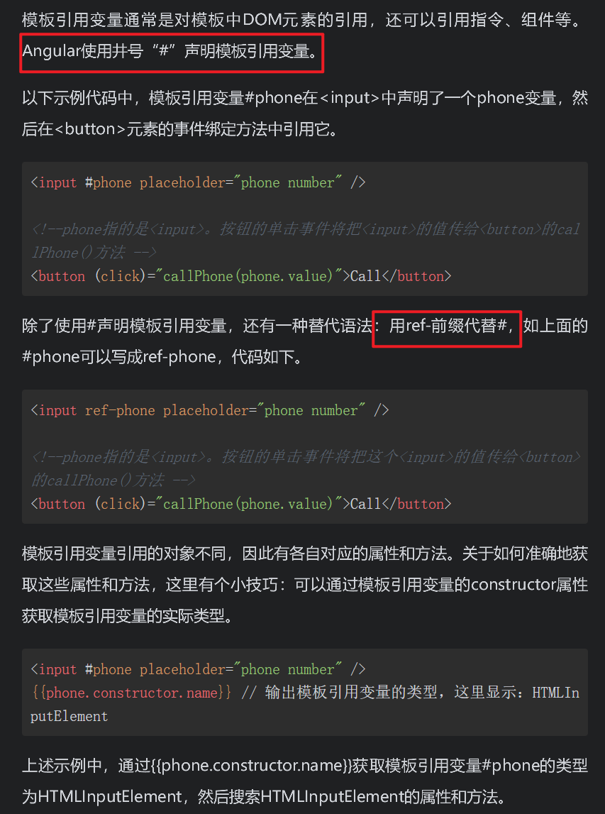

### 版本

​		2016年9月，谷歌公司发布了Angular 2。它是由AngularJS的同一个开发团队完全重写AngularJS而成的，与网络日益现代的需求相匹配。现在人们常说的Angular（后面没有JS）泛指Angular 2之后的Angular。

### 核心概念

1. 服务

​		Angular把组件和服务区分开，以增强模块性和复用性。通过把组件中和视图有关的功能与其他类型的功能分开，组件变得更加精简、高效。在功能方面，组件聚焦于展示数据，把数据访问的职责委托给某个服务。因此服务是实现单一目的的业务逻辑单元，它封装了某一特定功能，如从服务器获取数据、验证用户输入或直接往控制台中写日志等。服务是可以通过注入的方式供用户使用的独立模块。

2. 依赖注入

​		依赖注入其实不是Angular独有的概念，这是一个已经存在很长时间的设计模式，也可以叫作控制反转（Inverse of Control）。熟悉Java和.NET的用户对这种设计模式不会感到陌生，Java的Spring框架里的IOC就是一种这样的设计模式。Angular也提供了依赖注入。因为组件是用TypeScript写的类，所以依赖关系通常通过构造函数注入。在Angular中，我们可以创建一个可重用的软件对象来处理与服务器的通信，通过构造函数将它注入每个需要它的对象（类）。

3. 指令

​		Angular的模板是动态的。当Angular渲染它们时，Angular会根据指令对DOM进行修改。Angular中包含以下3种类型的指令。

- 属性指令：以元素的属性形式来使用的指令。

- 结构指令：用来改变DOM树的结构的指令。

- 组件指令：作为指令的一个重要子类，组件本质上可以看作一个带有模板的指令。

4. 管道

   Angular的管道的作用是把数据作为输入，然后转换它，给出期望的输出。

   常见的管道有：日期管道，负责转换日期为友好的本地格式；货币管道，负责转换货币格式；异步管道，可实时订阅数据；等等。

5. 模块

   Angular的模块的作用是把组件、指令、服务等打包成内聚的功能块，封装或暴露相应的功能，从而达到模块间的解耦，是高度自治的一种程序设计模式。换句话说，模块对应的是业务和功能，组件对应的才是页面展示和交互。

### Angular CLI常用命令

创建命令的格式为ng generate <type> [options]，可以简写为ng g <type>[options]


### Angular项目结构


### Angular 项目的启动过程

​	Angular项目的启动过程分为以下几步。

​	（1）当在终端执行ng serve命令时，Angular CLI会根据angular.json文件中的main元素找到项目的入口文件main.ts。

​	（2）main.ts文件加载AppModule根模块（app.module.ts文件）。

​	（3）AppModule根模块引导AppComponent根组件（app.component.ts文件）。

​	（4）AppComponent根组件完成自身的初始化工作，如完成标签<app-root>的初始化工作。

### Angular组件详解

#####  	什么是Angular组件

​	Angular组件对应的是Component类的文件，默认情况下，它是使用TypeScript编写的，在组件中绑定了模板和样式，组件控制着模板中的元素，如视图显示和触发事件等。用户在Component类中定义组件的应用逻辑，为视图提供支持。组件通过一些由属性和方法组成的API与视图交互。所有使用Angular开发的Web应用程序都有一个根组件，根组件通常被称为App组件，App组件下可以存在若干个子组件。Angular为组件提供了相互传递数据和响应彼此事件的方法。本书后续章节将会介绍组件的输入和输出。组件被设计为自包含且松散耦合的结构，每个组件都包含有关自身的数据，举例如下。

- 它需要什么输入数据。

- 它可能向外界发射的事件。

- 如何展示自己。

- 它的依赖性是什么。

通常，每个组件由3个文件组成：模板（Template）文件、类（TypeScript）文件和样式（CSS）文件。默认情况下，Angular中已经有了一个应用程序（App）组件。

#####  	组件模板的种类

​		 Angular中的组件模板就是MVVM模式中的V，它扮演的是一个视图的角色，简单来说就是展示给用户看的部分。组件模板包含用于在浏览器中显示组件的标记代码，组件通过@Component()装饰器把组件类和模板关联在一起。

 		Angular组件类中有两种方法为组件指定渲染模板。组件模板主要分为内联模板和外部模板。

​			1. 内联模板

​		@Component()装饰器中的template属性可直接指定内联模板。


 		template属性的值是用反引号“`”引用的一个多行字符串，这个多行字符串是标准的HTML代码。

​		 2.  外部模板

​		@Component()装饰器中的templateUrl属性可引用外部模板。


​		templateUrl属性的值是模板文件的URL，上述代码表示引用的是当前目录下的app.com ponent.html文件。

​		至于是选择内联模板还是外部模板，并没有绝对的依据，用户根据自己的实际情况来选择即可。内联模板能减少文件量，适合模板内容简单、代码量少的场景。

#####  组件类的构成

   		Angular中的组件类就是MVVM模式中的VM（ViewModel，视图模型），ViewModel是View和Model的结合体，负责View和Model的交互和协作。组件类的作用是控制模板渲染。

​			Angular中用@Component()装饰器声明组件类，@Component()装饰器会指出紧随其后的类是组件类，并告知Angular如何处理这个组件类。该装饰器包含多个属性，这些属性及其值称为元数据。元数据告诉Angular到哪里获取它需要的主要信息，以创建和展示这个组件类及其视图

​	1. @Component()装饰器的其他元数据配置选项


​	2.  属性绑定

- Class样式绑定

  

- Style样式绑定

  

- DOM属性绑定

​		 DOM属性绑定指通过方括号“[]”将模板视图中的DOM属性与组件类中的属性进行绑定，形如[DOM属性]="组件类中的属性"。如，

- HTML特性绑定

​		HTML特性绑定的语法类似于DOM属性绑定，但其方括号之间不是元素的DOM属性，而是由前缀 attr. 和HTML特性名称 组成的字符串，形如[attr.HTML特性名称]。

##### 组件的生命周期


##### 父子组件的交互

1. @Input()装饰器：父组件传递数据到子组件。

2. @Output()装饰器：子组件传递数据到父组件

   子组件暴露一个EventEmitter对象，当事件发生时，子组件利用该对象的emits()方法对外发射事件。父组件绑定到这个事件，并在事件发生时做出回应。

   

##### 模板表达式

​	管道运算符

使用“|”分隔模板表达式和管道函数，它会把左侧的模板表达式结果传给右侧的管道函数。


##### 模板语句

​	


##### 模板引用

​	模板引用用来从模板视图中获取匹配的元素，这些元素可以是一个或多个

1. 模板引用变量

   

   

2.  @ViewChild()装饰器

​		@ViewChild()装饰器是由Angular提供的属性装饰器，用来从模板视图中获取匹配的元素，返回匹配的一个或首个元素。

​	使用@ViewChild()装饰器时需注意：查询视图元素的工作在组件的生命周期AfterViewInit开始时完成，因此在ngAfterViewInit()方法中能正确获取查询的元素

```ts
import {
  Component, AfterViewInit, ViewChild, AfterContentInit,
  OnInit, ElementRef, AfterViewChecked
} from '@angular/core';

@Component({
 selector: 'app-root',
 template: `
   <h1>Welcome to Angular World</h1>
   <p #title1>Hi {{ name }}</p>
   <p #title2>Hello {{ name }}</p>
 `,
 styles: []
})
export class AppComponent implements OnInit, AfterContentInit, AfterViewInit,
  AfterViewChecked {

  name: string = 'Murphy';

  @ViewChild('title1', { static: false })
  ctitle1: ElementRef;

  @ViewChild('title2', { static: true })
  ctitle2: ElementRef;

  // 方法1
  ngOnInit() {
   console.log('ctitle1 in ngOnInit : ' + this.getTitleValue(this.ctitle1))
   console.log('ctitle2 in ngOnInit : ' + this.getTitleValue(this.ctitle2))
  }

  // 方法2
  ngAfterContentInit() {
   console.log('ctitle1 in ngAfterContentInit : ' + this.getTitleValue(this.ctitle1))
   console.log('ctitle2 in ngAfterContentInit : ' + this.getTitleValue(this.ctitle2))
  }

  // 方法3
  ngAfterViewInit() {
   console.log('ctitle1 in ngAfterViewInit : ' + this.getTitleValue(this.ctitle1))
   console.log('ctitle2 in ngAfterViewInit : ' + this.getTitleValue(this.ctitle2))
  }

  // 方法4
  ngAfterViewChecked() {
   console.log('ctitle1 in ngAfterViewChecked : ' + this.getTitleValue(this.ctitle1))
   console.log('ctitle2 in ngAfterViewChecked : ' + this.getTitleValue(this.ctitle2))
  }

  // 如果传入的元素不为空，则输出该元素的文本内容
  getTitleValue(v: ElementRef) {
   return v ? v.nativeElement.innerHTML : v
  }
}
```


（1）模板中定义了两个模板变量title1和title2，同时在类中定义了两个类属性变量ctitle1和ctitle2，用@ViewChild()装饰器分别引用两个模板变量，注意为它们提供了不同的static值。

（2）模板中<p>标签的内容由静态字符串和动态插值表达式组成；Hello和Hi是静态字符串，插值表达式{{name}}是动态的，它的值来自组件类。

（3）组件类一共实现了4个生命周期接口，每个生命周期接口的回调方法尝试获取类属性变量引用的信息，并且在控制台中分别输出。

（4）4个生命周期接口的回调方法发生的顺序是ngOnInit()、ngAfterContentInit()、ngAfterViewInit()、ngAfterViewChecked()。

（5）无论static值为true还是false，在组件的生命周期AfterViewInit发生之后，@ViewChild()装饰器都能获取到HTML元素中的内容，因此在方法3和方法4中能输出HTML元素中的内容。

（6）当static值为true时，@ViewChild()装饰器可以获取HTML元素中的静态内容，因此在方法1和方法2中获取的ctitle2的值为Hello。

（7）当static值为false时，在组件的生命周期AfterViewInit发生前，@ViewChild()装饰器获取不到任何内容，因此在方法1和方法2中ctitle1的输出值为undefined。

3.  @ViewChildren()装饰器

​		与@ViewChild()装饰器一样，用来从模板视图中获取匹配的元素，不同的是返回匹配的所有元素。

```ts
@ViewChildren('title1, title2')
ctitles: ElementRef[];
```


##### $event模板变量的应用，下面列出常见的3种用法

```ts
<!-- 访问模板变量 $event， $event.target.value返回当前控件（input）value属性的值-->
1.<input (change)="updateName($event.target.value)">

<!-- 与上面的结果一致。先声明一个模板变量#name，然后引用它的value属性的值 -->
2.<input #name (change)="updateName(name.value)">

<!-- 调用多个方法示例 -->
3.<input (keyUp)="updateName($event.target.value); validate()">
```


##### 双向数据绑定


**自定义NgModel**

```ts
//子组件.html
<div>大小：{{size}}</div>
<button (click)="handleSizeChange()">尺寸改变</button>
//子组件.ts
@Input()
  size: number = 0;

@Output()
  sizeChange = new EventEmitter<number>();

handleSizeChange() {
    this.sizeChange.emit(Math.random()*10);
}
//父组件引用
<app-test  [(size)]="size"></app-test>

```

`注意: 变量名称x和xChange中的x仅是一个标识，可以替换为任何有效的变量名`


### 指令

​	指令是DOM元素上的标记（如属性），它告诉Angular要将指定的行为附加到现有DOM元素。指令的核心是一个**函数**，只要Angular编译器在DOM元素中找到指令，该指令就执行。

​	这些指令可以通过添加和删除视图DOM元素来更改DOM布局，我们称这些指令为**结构型指令**。另一些指令可能只是改变一个DOM元素的外观或行为，这样的指令我们称为**属性型指令**。

**结构型指令**：如添加、移除或修改DOM元素。Angular中包含3个常用的内置结构型指令：NgIf、NgFor和NgSwitch。

- NgFor指令的内置变量：


- NgSwitch

```ts
<container-element [ngSwitch]="switch_expression">
  <some-element *ngSwitchCase="match_expression_1">...</some-element>
...
  <some-element *ngSwitchDefault>...</some-element>
</container-element>
```

当NgSwitchCase指令的绑定值等于开关值（switch_expression）时，就将NgSwitchCase指令所在的元素添加到DOM中，否则从DOM中移除


**ng-container分组元素**

​	ngular的ng-container是一个分组元素，但它不会影响样式或DOM布局，因为Angular不会把它放进DOM中。ng-container是一个由Angular解析器负责识别处理的语法元素。它不是一个指令、组件、类或接口，更像是JavaScript的if块中的花括号。当没有合适的宿主元素时，用户可以使用ng-container对元素进行分组。

​	<ng-container>的使用场景之一是，在需要遍历或if判断时，它可以起到一个载体的作用。


**属性型指令** 

​	属性型指令用于改变一个DOM元素的外观或行为，Angular中包含一些常用的内置属性型指令：NgClass、NgStyle和NgContent

NgClass


NgStyle:

NgStyle指令接收一个键/值（Key/Value）对的对象表达式，键/值对的键是一个样式属性。用户可以在键上添加一个前缀简化写法，比如下面的写法。


**NgContent指令**

​		NgContent指令的作用是帮助开发者创建可重用和可组合的组件。NgContent指令的格式为<ng-content></ng-content>。我们可以将<ng-content>理解为动态内容的占位符，在解析模板时，Angular将其替换为动态内容。在Angular中，这一操作被称为“内容投影”，意思是将内容从父组件投影到子组件中，子组件中包含NgContent指令。

**@ContentChildren()装饰器中使用NgContent指令**

​		@ContentChild()装饰器和@ContentChildren()装饰器很像，类似@ViewChild()装饰器和@ViewChildren()装饰器（参照本书第7章）。

之所以要将@ContentChild()装饰器和@ContentChildren()装饰器放在本章讲解，是因为它们依赖NgContent指令；更准确地说，必须要等到读者了解了NgContent指令的知识后，我们才能继续讲解@ContentChild()装饰器和@ContentChildren()装饰器的知识。

​		首先进行简单的介绍。@ContentChildren()装饰器与内容子节点有关，它用于操作投影进来的内容。@ContentChildren()装饰器与@ViewChild()装饰器的区别是，@ViewChild()装饰器是与模板视图本身的子节点有关的，它用于操作模板自身的视图内容。

​		@ContentChild()和@ContentChildren()都是参数装饰器，分别用于从内容DOM中获取子元素或指令的查询对象（Query）和查询列表对象（QueryList）。每当添加或删除子元素/组件时，Query或QueryList都会更新。子元素或指令的查询在组件的生命周期AfterContentInit开始时完成，因此在ngAfterContentInit()方法中，就能正确获取查询的元素。

**创建指令**

​		指令和组件一样，都有对应的Angular类，类都有构造函数。指令类用@Directive()装饰器声明。@Directive()装饰器和@Component()装饰器类似，它接收的也是一个元数据


但是，指令和组件并不完全相同：如组件需要视图，而指令不需要；指令没有模板，指令将行为添加到现有DOM元素上。

创建指令的方法与创建组件类似，主要命令如下

```ts
ng generate directive 指令名称 # 简写：ng g d 指令名称
```

​	如前所述，指令是DOM元素（如属性）上的标记，它告诉Angular将指定的行为附加到现有DOM元素。这意味着我们需要一种方法来访问应用该指令的DOM元素，以及修改DOM元素的方法。Angular为我们提供了两个非常有用的对象：ElementRef对象和Renderer2对象:

​	●ElementRef对象：可以通过ElementRef对象的nativeElement属性直接访问应用该指令的DOM元素。

​	●Renderer2对象：Renderer2对象可实现自定义渲染器，它提供了许多辅助方法，如可以通过该对象修改DOM元素的样式。

我们可以将两者通过构造函数注入指令类中，并使每个DOM元素成为私有实例变量，代码如下。

```ts
constructor(private element: ElementRef, private renderer: Renderer2) { }
```

```ts
import { Directive, OnInit, ElementRef, Renderer2 } from '@angular/core';
@Directive({
    selector: '[log]', // HTML标签的属性名称
    inputs : ['size'] // 绑定指令的输入属性
})
export class LogDirective implements OnInit {
	constructor(private element: ElementRef, private renderer: Renderer2) { }
	size: string; // 与元数据中的输入属性对应
    ngOnInit() {
      this.renderer.setStyle(this.element.nativeElement, 'font-size', this.size);
    }
}

//使用
import { Component } from '@angular/core';

@Component({
    selector: 'app-root',
    template: `
      <button log size=18px>click me</button>
    `,
    styles: []
})
export class AppComponent {
	title = 'directive-ex600';
}
```

**重点**：指令类中的size属性其实是一个输入型属性，与宿主元素中的size属性绑定，用于接收按钮字体的大小值。如果在@Directive()装饰器中省略inputs元数据，那么指令类中的size属性需要用@Input()装饰器进行声明。

```ts
@Directive({
	selector: '[log]', // HTML标签的属性名称
})
export class LogDirective implements OnInit {

@Input() size: string; // 定义输入型属性，对应宿主元素中的size属性

// …
```


**在指令中监听事件**

@Directive()装饰器中的inputs元数据用于绑定属性，它还有一个host元数据，用于绑定事件

@Directive()装饰器中的host元数据是用来监听宿主元素对象的，host元数据接收一组键/值对数据。

当Key为属性时，对应的是宿主元素的DOM属性，Value对应的是具体的DOM属性的值；

When the key is a property of the host element, the property value is the propagated to the specified DOM property.

When the key is a static attribute in the DOM, the attribute value is propagated to the specified property in the host element.

当Key为事件名时，对应的就是监听宿主元素上的DOM事件，Value对应的是处理的方法。@Directive()装饰器通过host元数据将指令的触发事件与指令类中的方法进行绑定。

```ts
import { Directive, ElementRef, Renderer2 } from '@angular/core';

@Directive({
    selector: '[log]',
    host: { // 绑定事件
      '(click)': 'onClick($event)'
    }
})
export class LogDirective {

    constructor(private elementRef: ElementRef, private renderer: Renderer2) { }
    count: number = 0

    onClick(event: Event) {
      console.log('click', event); // 控制台输出event模板变量信息
      this.count += 1
      console.log('counts', this.count) // 控制台输出count值

      const textContent = 'click me '
      this.renderer.setProperty(this.elementRef.nativeElement,
        'textContent', textContent + this.count.toString()); // 设置按钮的文本值
      this.renderer.setStyle(this.elementRef.nativeElement,
        'background-color', 'yellow'); // 设置按钮的背景颜色
    }
}
```

```ts
//使用指令
import { Component } from '@angular/core';

@Component({
   selector: 'app-root',
   template: `
      <button log>click me</button>
   `,
   styles: []
})
export class AppComponent {
  title = 'directive-ex700';
}
```


`tip`


