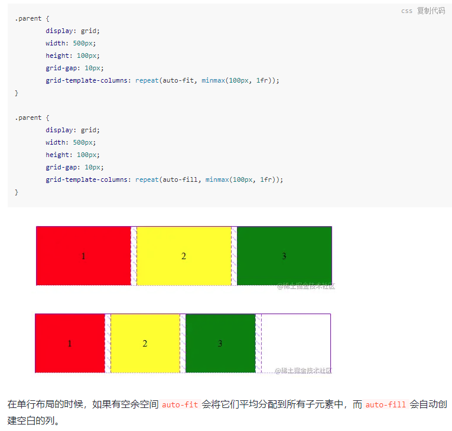

[align-content](https://juejin.cn/post/6844903911690600456)

[auto-fit和auto-fill的区别](https://juejin.cn/post/6844903565463388168)

- `auto-fit`和`auto-fill`两个关键字自动分配空间。通常情况下，这两个关键字的使用效果都差不多，唯一的差别是空余空间的分配规则。

