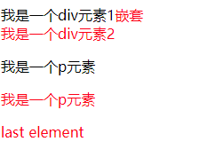
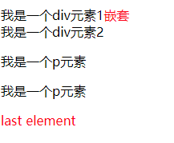

- last-of-type : 会先根据tag类型分组，然后拿到最后一个，看看是不是.box

```html
<!DOCTYPE html>
<html lang="zh-cn">

<head>
    <meta charset="utf-8" />
    <meta name="author" content="Joy Du(飘零雾雨), dooyoe@gmail.com, www.doyoe.com" />
    <style>
        .box:last-of-type {
            color: #f00;
        }
    </style>
</head>

<body>
    <div class="test">
        <div class="box">我是一个div元素1<span class="box">嵌套</span></div>
        <div class="box">我是一个div元素2</div>
        <p class="box">我是一个p元素</p>
        <p class="box">我是一个p元素</p>
        <span class="box">last element</span>
    </div>
</body>

</html>
```



- last-child : .box是子元素的最后一个

  ```html
  <!DOCTYPE html>
  <html lang="zh-cn">
  
  <head>
      <meta charset="utf-8" />
      <meta name="author" content="Joy Du(飘零雾雨), dooyoe@gmail.com, www.doyoe.com" />
      <style>
          .box:last-child {
              color: #f00;
          }
      </style>
  </head>
  
  <body>
      <div class="test">
          <div class="box">我是一个div元素1<span class="box">嵌套</span></div>
          <div class="box">我是一个div元素2</div>
          <p class="box">我是一个p元素</p>
          <p class="box">我是一个p元素</p>
          <span class="box">last element</span>
      </div>
  </body>
  
  </html>
  ```

  