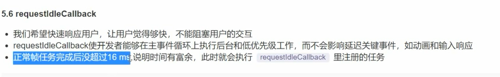

```html
<!DOCTYPE html>
<html lang="en">

<head>
    <meta charset="UTF-8">
    <meta name="viewport" content="width=device-width, initial-scale=1.0">
    <title>Document</title>
</head>

<body>
    <script>
        const sleep = (delay) => {
            for (let ts = Date.now(); Date.now() - ts <= delay;) { }
        }
        const works = [
            () => {
                console.log('任务1 start');
                sleep(10)
                console.log('任务1 end');
            },
            () => {
                console.log('任务2 start');
                sleep(20)
                console.log('任务2 end');
            },
            () => {
                console.log('任务3 start');
                sleep(1)
                console.log('任务3 end');
            }
        ]
        function performUnitWork() {
            const work = works.shift();
            work()
        }
        function workLoop(deadline) {
            console.log(`本帧剩余时间${deadline.timeRemaining()}`)
            while ((deadline.timeRemaining() > 1) && works.length > 0) {
                performUnitWork()
            }
            if (works.length > 0) {
                requestIdleCallback(workLoop)
            }
        }

        requestIdleCallback(workLoop)
    </script>
</body>

</html>
```

