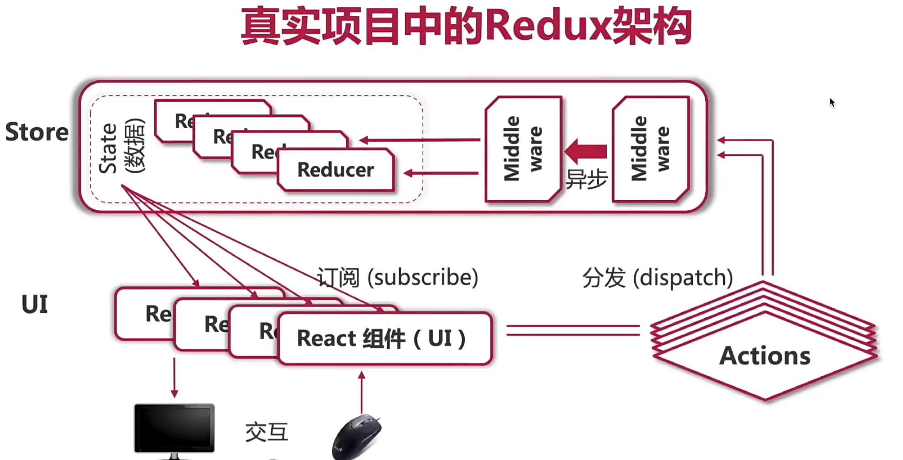
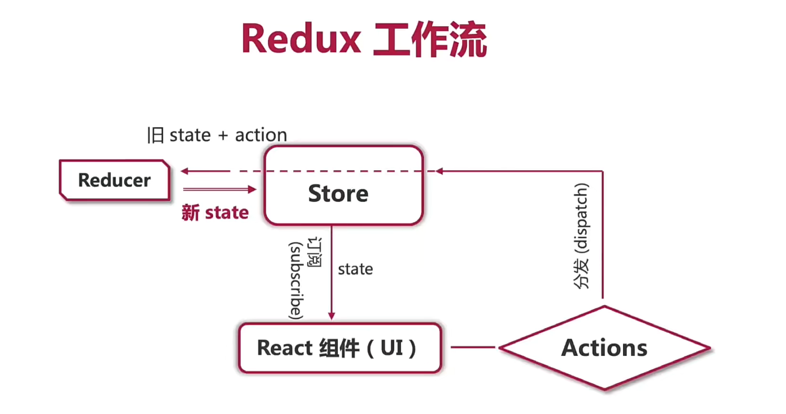

- redux中间件重写了store.dispatch方法

### saga

- put({type: types.INCRENMENT}) 向仓库派发一个动作

- delay(1000) 延迟一秒

- all() 类似promise.all

- takeEvery() 类似死循环，一直等待着一个动作发生while(true)+take
- take ：表示监听一个动作发生，返回值是动作action

- call 告诉saga中间件去调用一个函数，第一个参数是要执行的函数，后面的参数是传递给函数的参数。返回值是获取方法的返回值 或者 promise的resolve值

- yield call(delay,1000)