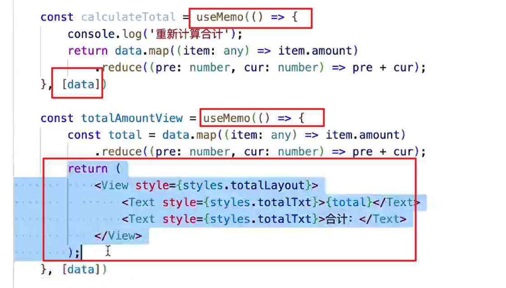
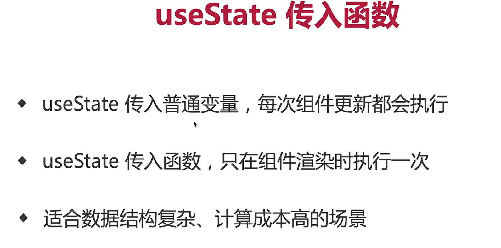
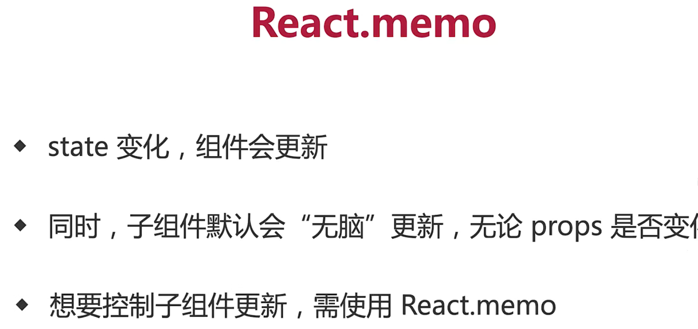

1. memo

- 避免多余渲染，重复计算，重复创建对象

- useMemo可以缓存数据或ui组件， 第一个参数是函数，该函数返回一个值或者ui组件

2. useState

3. React.memo 根据props变化来更新，而不是无脑更新

   

4. 使用lazy, 路由懒加载，拆分bundle，优化首页体积

5. webpack 配置splitChunks 拆分chunk