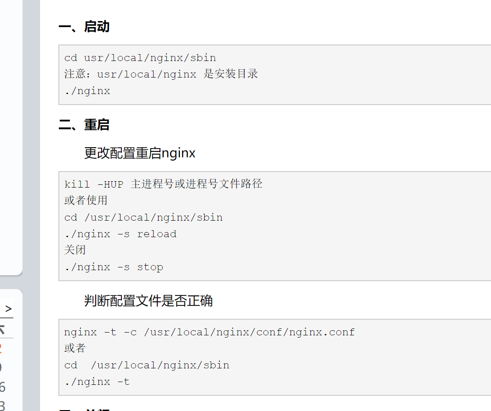
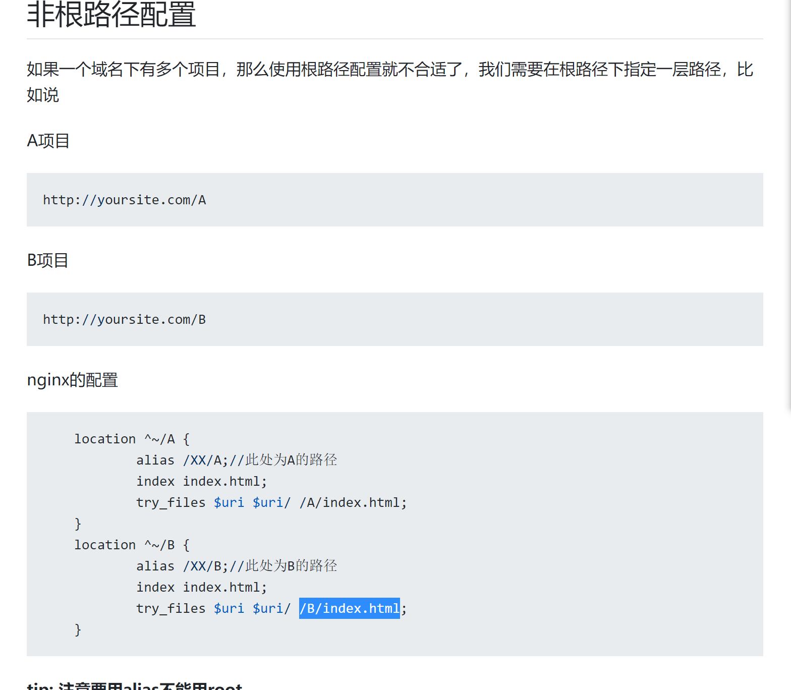

# nginx配置
- nginx常用命令


- root和alias的区别
alias是一个目录别名的定义，root则是最上层目录的定义.<br>
一直以为root是指的/var/www/image目录下，应该是/var/www/image/img/ <br>
还有一个重要的区别是alias后面必须要用 `/` 结束，否则会找不到文件的.  而root则可有可无~~
```
// 访问/img/目录里面的文件时，ningx会自动去/var/www/image/目录找文件
location /img/ {
    alias /var/www/image/;
}

// 访问/img/目录下的文件时，nginx会去/var/www/image/img/目录下找文件
location /img/ {
    root /var/www/image;
}
```

- 对于index，含义如下

```
  location / {
        root /var/www/;
        index index.htm index.html;
  }
```

这样，当用户请求 `/` 地址时，Nginx 就会自动在 root 配置指令指定的文件系统目录下依次寻找 `index.htm` 和`index.html` 这两个文件。如果 `index.htm` 文件存在，则直接发起“内部跳转”到 `/index.htm` 这个新的地址；而如果 `index.htm` 文件不存在，则继续检查 `index.html` 是否存在。如果存在，同样发起“内部跳转”到`/index.html`；如果 `index.html` 文件仍然不存在，则放弃处理权给 `content` 阶段的下一个模块

- alias的配置
如果webpack/vue-cli 的publicPath,或者vite的base ,为 "/myBase", 则所有引用路径会加上/myBase 。
假如把dist文件夹放在了服务器的 `/test/vue/dist/` 文件夹，nginx 的 location 可以这样配：

```
location /myBase {
    alias /test/vue/dist/;
    index index.html;
}
```


- 同个域名多个项目配置




