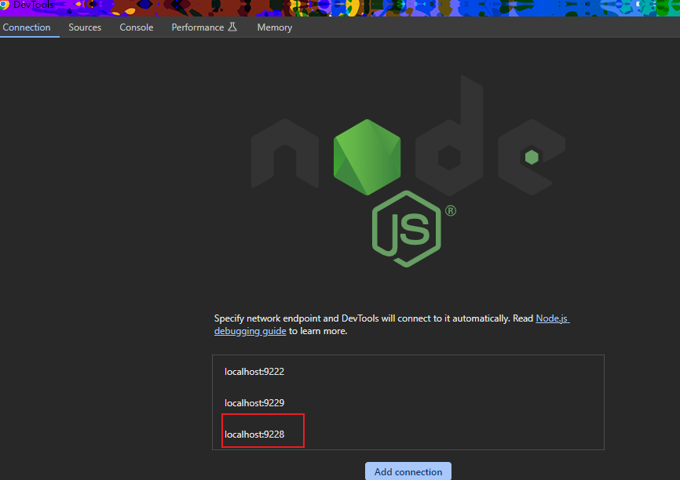
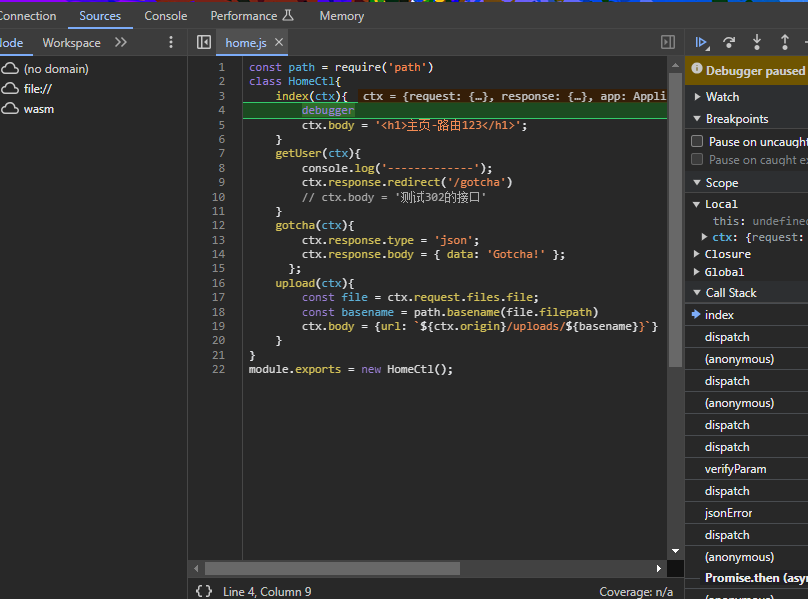

1. 指定项目inspect的端口（随便）

```js
 "scripts": {
    "start": "cross-env NODE_ENV=production node app",
    "dev": "nodemon --inspect=9228 app "
  }
```

2. 在浏览器输入 chrome://inspect 打开

   

   3. 访问有debugger的路由

