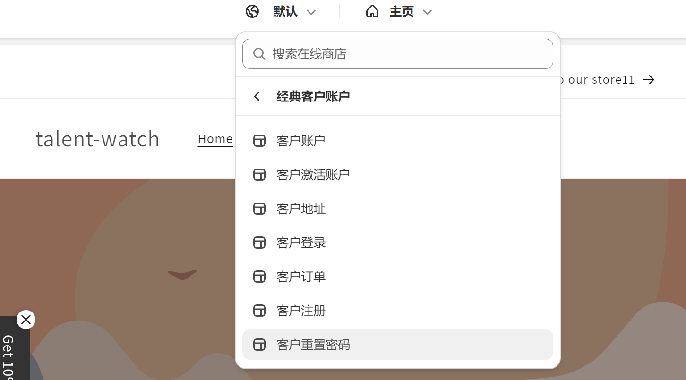

### 开发

- [help](https://help.shopify.com/en/partners/dashboard/managing-stores/development-stores)

- [检测shopify的服务器是否有问题]( https://www.shopifystatus.com/)
- [测试下单](https://help.shopify.com/en/manual/checkout-settings/test-orders)
- [图片库](https://www.pexels.com/)

- [拉取模板](https://community.shopify.com/c/%E6%8A%80%E6%9C%AF%E9%97%AE%E7%AD%94/%E5%88%9D%E5%AD%A6%E8%80%85-shopify-%E6%9C%AC%E5%9C%B0%E7%8E%AF%E5%A2%83%E9%85%8D%E7%BD%AE%E9%81%87%E8%A7%81%E7%9A%84%E9%97%AE%E9%A2%98-%E6%9C%9B%E8%A7%A3%E6%83%91/td-p/2366666)

  解决方案：shopify theme pull --password   [theme-access-密码](https://shopify.dev/docs/themes/tools/theme-access) --theme 模板id  --store https://talent-watch.myshopify.com/

- [如何使用tailwind css](https://gist.github.com/osama2kabdullah/e3a64df3d2b514ee2cfe8bbb19e4c8ac)

- 16:33:35 ERROR  » update package-lock.json:
    The asset #<struct ShopifyCLI::Theme::File path=#<Pathname:D:/Project/shopify/package-lock.json>> could not be synced (cause: undefined method `dig' for nil:NilClass) D:/SoftDownload/nvm/v18.19.0/node_modules/@shopify/theme/node_modules/@shopify/cli-kit/assets/cli-ruby/lib/shopify_cli/theme/syncer.rb:241:in `parse_api_errors'

  解决方案: [在.shopifyignore中忽略package.json](https://community.shopify.com/c/technical-q-a/shopify-cli-error-update-package-json/m-p/1242989)

### 插件

- [插件商店](https://apps.shopify.com/?locale=zh-CN)
- [营销弹窗](EcomSend Pop Ups, Email Popups)

### 语法

```liquid
example-section 是templates文件夹中某个文件


```

```liquid
icon-dropdown 是snippets文件夹中某个文件

```

### blog和 article区别

blog是列表

article 是某个blog详情

### 重置密码

这个页面没法直接打开，需要通过忘记密码通过邮件重设密码链接跳到页面



- alpine.js
