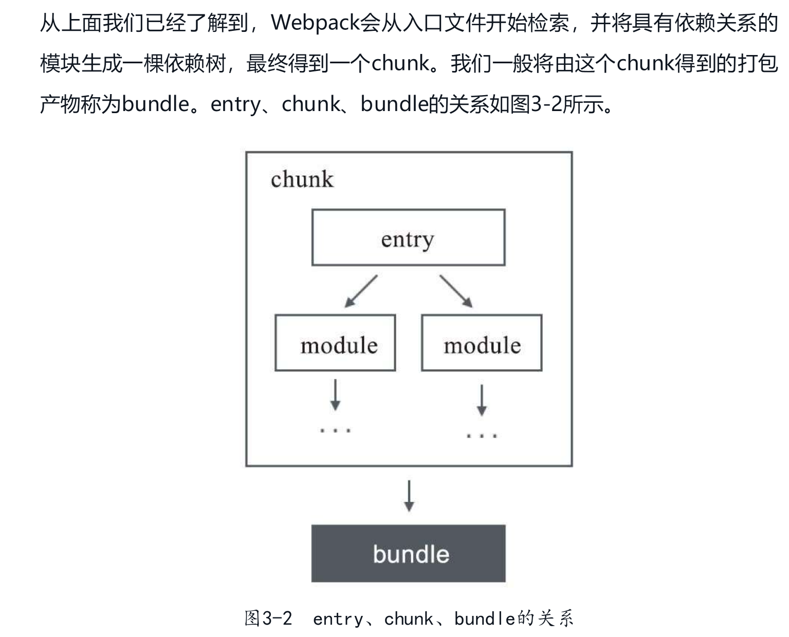

- commonjs：导出的是一个对象，exports.属性 不可能导出一个函数或者字符串数字

- commonjs2：导出的可能是任何内容， module.exports = xx

- module、chunk、bundle的关系：

  

看这个图就很明白了：

1. 对于一份同逻辑的代码，当我们手写下一个一个的文件，它们无论是 ESM 还是 commonJS 或是 AMD，他们都是 **module** ；
2. 当我们写的 module 源文件传到 webpack 进行打包时，webpack 会根据文件引用关系生成 **chunk** 文件，webpack 会对这个 chunk 文件进行一些操作；
3. webpack 处理好 chunk 文件后，最后会输出 **bundle** 文件，这个 bundle 文件包含了经过加载和编译的最终源文件，所以它可以直接在浏览器中运行。

一般来说一个 chunk 对应一个 bundle，比如上图中的 `utils.js -> chunks 1 -> utils.bundle.js`；但也有例外，比如说上图中，我就用 `MiniCssExtractPlugin` 从 chunks 0 中抽离出了 `index.bundle.css` 文件。

###  一句话总结：

`module`，`chunk` 和 `bundle` 其实就是同一份逻辑代码在不同转换场景下的取了三个名字：

我们直接写出来的是 module，webpack 处理时是 chunk，最后生成浏览器可以直接运行的 bundle。




- 代码分片：使用户不必一次加载全部代码，而是按需加载。

- 公共模块提取。

- CommonsChunkPlugin与SplitChunksPlugin

- 资源异步加载原理。

- 提取vendor：

  虽然CommonsChunkPlugin主要用于提取**多入口之间的公共模块**，但这不代表对于单入口的应用就无法使用。我们仍然可以用它来提取第三方类库及业务中不常更新的模块，只需要单独为它们创建一个入口即可

- 与正常ES6中的import语法不同，通过import函数加载的模块及其依赖会被异步地加载，并返回一个Promise对象

  ```js
  一个正常模块加载
  // foo.js
  import { add } from './bar.js';
  console.log(add(2, 3));
     
  // bar.js
  export function add(a, b) {
      return a + b;
  }
  
  //假设bar.js的资源体积很大，并且我们在页面初次渲染的时候并不需要使用它，所以可以对它进行异步加载。
  // foo.js
  import('./bar.js').then(({ add }) => {
      console.log(add(2, 3));
  });
     
  // bar.js
  export function add(a, b) {
      return a + b;
  }
  ```

  import函数还有一个比较重要的特性。ES6 Module中要求import必须出现在代码的顶层作用域，而Webpack的import函数则可以在任何我们希望的时候调用。如

  ```js
  if (condition) {
      import('./a.js').then(a => {
          console.log(a);
      });
  } else {
      import('./b.js').then(b => {
          console.log(b);
      });
  }
  ```

  这种异步加载方式可以赋予应用很强的动态特性，它经常被用来在用户切换到某些特定路由时去渲染相应组件，这样分离之后首屏加载的资源就会小很多。

- 异步模块

  异步chunk默认没有名字，其默认值是[id].js。可通过output.chunkFilename配置