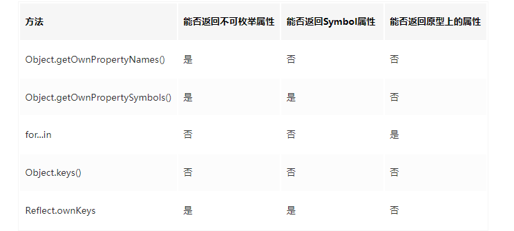

## script 标签：调整加载顺序提升渲染速度

- **async 属性**。立即请求文件，但不阻塞渲染引擎，而是文件加载完毕后阻塞渲染引擎并立即执行文件内容。
- **defer 属性**。立即请求文件，但不阻塞渲染引擎，等到解析完 HTML 之后再执行文件内容。
- **HTML5 标准 type 属性**，对应值为“module”。让浏览器按照 ECMA Script 6 标准将文件当作模块进行解析，默认阻塞效果同 defer，也可以配合 async 在请求完成后立即执行。

绿色的线表示执行解析 HTML ，蓝色的线表示请求文件，红色的线表示执行文件