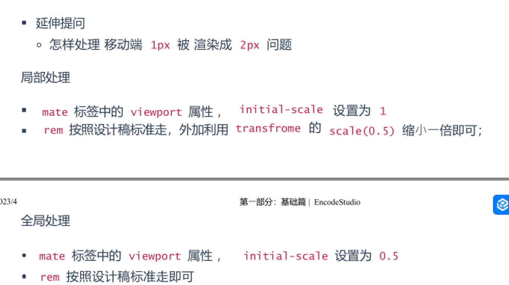
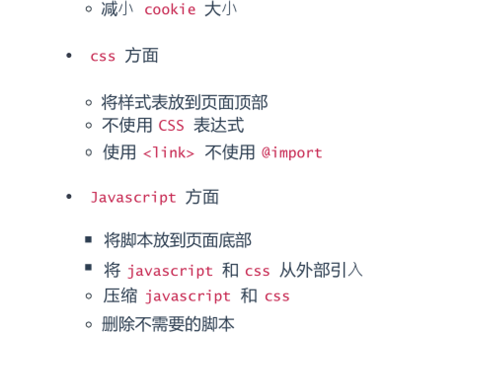
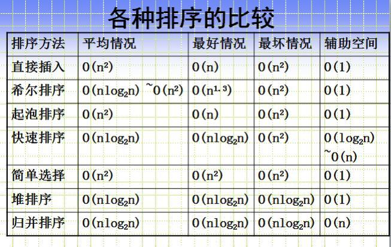

#### 前端需要注意哪些SEO

- 合理的 title 、 description 、 keywords 
- 少用 iframe ：搜索引擎不会抓取 iframe 中的内容
- 重要内容 HTML 代码放在最前：搜索引擎抓取 HTML 顺序是从上到下， 有的搜索引擎对抓
  取⻓度有限制，保证重要内容⼀定会被抓取

- ⾮装饰性图片必须加 alt
- 提高网站速度： 网站速度是搜索引擎排序的⼀个重要指标

#### img 的 title 和 alt 有什么区别

- title: 通常当鼠标滑动到元素上的时候显示
- alt: 是  的特有属性， 是图片内容的等价描述，用于图片⽆法加载时显示 、读屏器
  阅读图片 。可提图片高可访问性， 除了纯装饰图片外都必须设置有意义的值， 搜索引擎会
  重点分析。

 ####   iframe有那些缺点？

- iframe 会阻塞主⻚⾯的 Onload 事件
- 搜索引擎的检索程序无法解读这种⻚⾯，不利于 SEO
- iframe 和主⻚⾯共享连接池， 而浏览器对相同域的连接有限制，所以会影响⻚⾯的并⾏
  加载
- 使用 iframe 之前需要考虑这两个缺点 。如果需要使用 iframe ， 最好是通过
- javascript 动态给 iframe 添加 src 属性值， 这样可以绕开以上两个问题

#### 怎样处理 移动端 1px 被 渲染成 2px 问题

- 页面头部的   会阻塞页面；( 因为 Renderer
  进程中 JS 线程和渲染线程是互斥的)

- <link href="common.css" rel="stylesheet"/> 那么浏览器会识别该⽂档为 css ⽂
  件，就会并⾏下载资源并且不会停止对当前⽂档的处理 。这也是为什么建议使用 link ⽅
  式来加载 css ， 而不是使用 @import ⽅式

#### ⼀个页面上有大量的图片 (大型电商网站) ，加载很慢，你有哪些方法优化这些图片的加载，给用户更好的体验。

- 图片懒加载，在页面上的未可视区域可以添加⼀个滚动事件， 判断图片位置与浏览器顶端
  的距离与页面的距离， 如果前者小于后者，优先加载。

- 如果为幻灯片 、相册等， 可以使用图片预加载技术，将当前展示图片的前⼀张和后⼀张优
  先下载。

- 如果图片为css图片， 可以使用 CSSsprite ， SVGsprite ， Iconfont 、 Base64 等技
  术。

- 如果图片过大， 可以使用特殊编码的图片，加载时会先加载⼀张压缩的特别厉害的缩略
  图， 以提高用户体验。

  

- 常见排序算法的时间复杂度,空间复杂度

#### display: none; 与 visibility: hidden; 的区别
联系：它们都能让元素不可⻅
区别：

- display:none ;会让元素完全从渲染树中消失， 渲染的时候不占据任何空间；
  visibility: hidden ;不会让元素从渲染树消失， 渲染师元素继续占据空间， 只是内
  容不可⻅
- display: none ;是⾮继承属性， ⼦孙节点消失由于元素从渲染树消失造成， 通过修改
  ⼦孙节点属性⽆法显示 ；visibility: hidden; 是继承属性， ⼦孙节点消失由于继承
  了 hidden ， 通过设置 visibility: visible; 可以让⼦孙节点显式
- 修改常规流中元素的 display 通常会造成⽂档重排 。修改 visibility 属性只会造成
  本元素的重绘。
- 读屏器不会读取 display: none ;元素内容；会读取 visibility: hidden; 元素内容

#### 如果需要手动写动画，你认为最小时间间隔是多久， 为什么？ ( 阿里)
多数显示器默认频率是 60Hz ， 即 1 秒刷新 60 次，所以理论上最小间隔为
1/60*1000ms ＝ 16.7ms