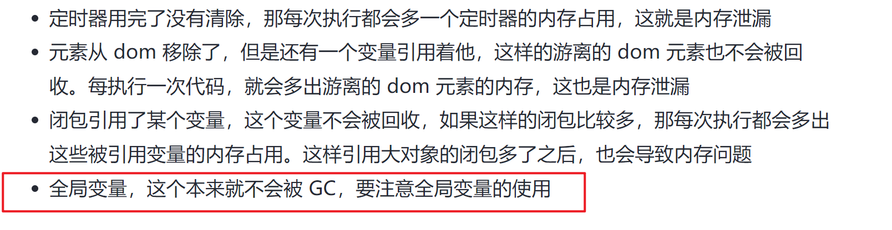

- import vs require

  1. import 在代码编译时被加载，所以必须放在文件开头，require 在代码运行时被加载，所以 require 理论上可以运用在代码的任何地方，所以 import 性能更好。
  2. import 引入的对象被修改时，源对象也会被修改，相当于浅拷贝，
     require 引入的对象被修改时，源对象不会被修改，官网称值拷贝，我们可以理解为深拷贝。

- 测试时间有没有更新

- 闭包: 函数嵌套函数时，内层函数引用了外层函数作用域下的变量，并且内层函数在全局环境下可访问，进而形成闭包。

- **内存泄漏，也就是代码执行完了不释放内存的流氓行为。**

- 总之，**全局变量、闭包引用的变量、被移除的 dom 依然被引用、定时器用完了没清除、console.log 都会发生代码执行完了，但是还占用着一部分内存的流氓行为，也就是内存泄漏。**

