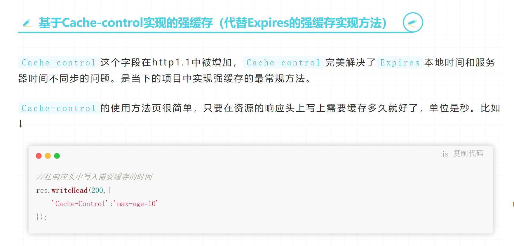
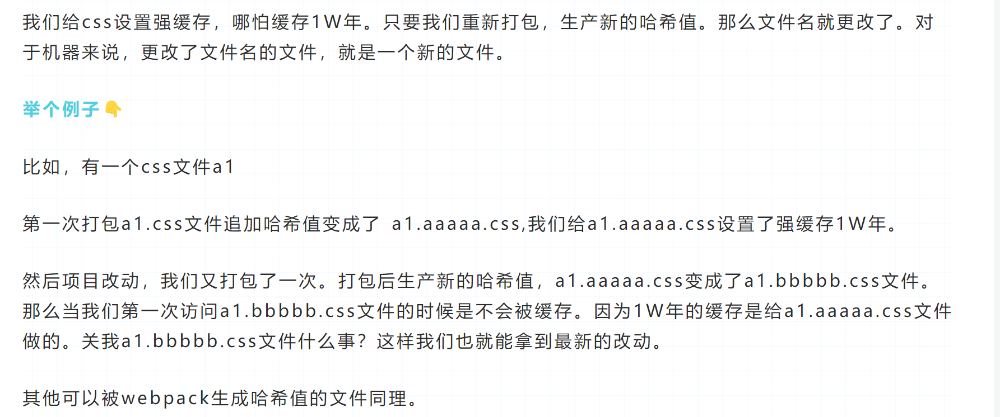
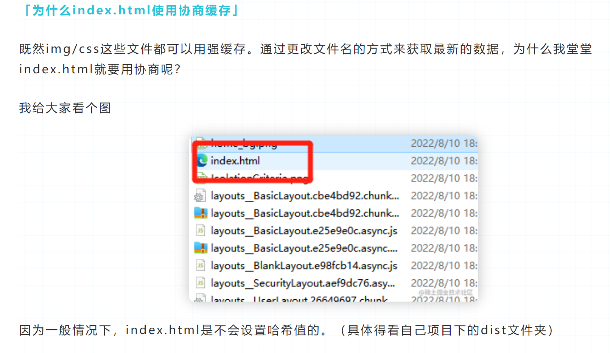

### 强制缓存只对引用资源生效，直接访问的资源不会走强制缓存。
```js
res.setHeader('Cache-Control', 'max-age=30'); //30秒之内不用找我（相对时间）
res.setHeader('Expires', new Date( Date.now() + 30*1000) ).toUTCString();// 访问后 到几点别找我了（绝对时间）
```
- 缺陷：服务端更改文件了 ，客户端用的还是老的文件。
- 强制缓存是不发送请求的！，但协商缓存会每次发送请求！！

### 协商缓存类型：
 1. no-cache 浏览器缓存文件了，但每次都发送请求到服务器
 2. no-store 浏览器不会缓存文件，每次都发送请求到服务器
 ```js
  res.setHeader('Cache-Control', 'no-cache'); //这是为了每次都向服务器发请求（因为浏览器有默认强制缓存时间）
 
  let ctime = statObj.ctime.toUTCString();
  if( req.headers['if-modified-since'] == ctime){
    res.statusCode = 304;
    res.end();// 浏览器会找缓存
  }else{
    res.setHeader('Last-Modified', ctime) //之后浏览器每次请求都会带上If-Modified-Since请求头
    fs.createReadStream(filePath).pipe(res);
  }
 ```
 - last-modified 缺陷：
  1. 如果资源更新的速度是秒以下单位，那么该缓存是不能被使用的，因为 If-Modified-Since 只能检查到以秒为最小计量单位的时间差。
  2. 如果文件是通过服务器动态生成的，那么该方法的更新时间永远是生成的时间，尽管文件可能没有变化，所以起不到缓存的作用。

    我们编辑了文件，但文件的内容没有改变。服务端并不清楚我们是否真正改变了文件，它仍然通过最后编辑时间进行判断。因此这个资源在再次被请求时，会被当做新资源，进而引发一次完整的响应——不该重新请求的时候，也会重新请求。

 - md5 （摘要算法）：不能反解，不能根据摘要的结果，反推出 摘要前的内容。
 - sha1/sha256(加盐算法）
 - 加密算法表示能解密

 - ETag方案：读取文件内容，产生一个md5戳，可以用md5 戳来做校验；浏览器发送的请求头带有If-None-Match
  ```js
  res.setHeader('Cache-Control', 'no-cache'); //这是为了每次都向服务器发请求（因为浏览器有默认强制缓存时间）
 
  let etag = crypto.createHash('md5').update(fs.readFileSync(filePath)).digest('base64');
  if( req.headers['if-none-match'] == etag){
    res.statusCode = 304;
    res.end();// 浏览器会找缓存
  }else{
    res.setHeader('Etag', etag) //之后浏览器每次请求都会带上If-Modified-Since请求头
    fs.createReadStream(filePath).pipe(res);
  }
  ```

 ### 强制缓存搭配协商缓存
 - HTTP缓存

主要有两种缓存：强缓存和对比缓存（也叫协商缓存）。

强缓存：只要请求了一次，在有效时间内，不会再请求服务器（请求都不会发起），直接从浏览器本地缓存中获取资源。主要字段有（expires：date（过期日期）、cache-control： max-age=time（秒数，多久之后过期） |no-cache|no-store）。如果expires和cache-control同时存在，cache-control会覆盖expires。建议两个都写，cache-control是http1.1的头字段，expires是http1.0的头字段，都写兼容会好点。

对比缓存：无论是否变化，是否过期都会发起请求，如果内容没过期，直接返回304，从浏览器缓存中拉取文件，否则直接返回更新后的内容。主要字 段有：

1、服务器端返回字段 Etag： xxxx (一般为md5值) 对应客户端匹 配字段为， If-None-Match: w/xxx(xxx的值和上面的etag的xxx一样则返 回304，否则返回修改后的资源)。

2、服务器端返回字段：Last-Modifieddate(日期),对应客户端匹配字段If-Modified-Since:date（如果服务器date小于等于客户端请求date则返回304，否则返回修改后的资源））。

同时存在各种缓存头时，各缓存头优先级及生效情况:

1、强缓存和对比缓存同时存在，如果强缓存还在生效期则强制缓存覆盖对比缓存，对比缓存不生效；如果强缓存不在有效期，对比缓存生效。即：强缓存优先级 > 对比缓存优先级

2、强缓存expires和cache-control同时存在时，则cache-control会覆盖expires，expires无论有没有过期，都无效。 即：cache-control优先级 > expires优先级。

3、对比缓存Etag和Last-Modified同时存在时，则Etag会覆盖Last-Modified，Last-Modified不会生效。即：ETag优先级 > Last-Modified优先级。

当然还有一种缓存pragma，和cache-control类似，前者是http1.0内容后者是http1.1内容，并且pragma优先级 > cache-control优先级，不过前者目前基本不使用。


### 常用的状态码
 - 304 请求资源与本地缓存相同
 - 301 重定向
 -  401 未认证
 - 403 未授权


- expires 

  **`Expires`已经被废弃了**。对于强缓存来说，`Expires`已经不是实现强缓存的首选。

  **因为Expires判断强缓存是否过期的机制是:获取本地时间戳，并对先前拿到的资源文件中的`Expires`字段的时间做比较。来判断是否需要对服务器发起请求。这里有一个巨大的漏洞：“如果我本地时间不准咋办？”**

  **是的，`Expires`过度依赖本地时间，如果本地与服务器时间不同步，就会出现资源无法被缓存或者资源永远被缓存的情况。所以，`Expires`字段几乎不被使用了。现在的项目中，我们并不推荐使用`Expires`，强缓存功能通常使用`cache-control`字段来代替`Expires`字段。**



上图表示从该资源第一次返回的时候开始，往后的10秒钟内如果该资源被再次请求，则从缓存中读取。

- 哪些文件对应哪些缓存 **有哈希值的文件设置强缓存即可。没有哈希值的文件（比如index.html）设置协商缓存**

1. **为什么有哈希值的文件设置强缓存**



2. **为什么index.html使用协商缓存**

   

https://juejin.cn/post/7127194919235485733