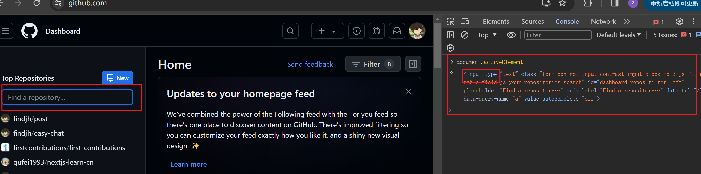

### 判断页面的光标是否在input元素上

 	如果`document.activeElement !== document.body` 就说明光标focus在了input上。 

在监听键盘删除键，做一些判断时有用



### dom元素的matches方法

用来检查元素是否匹配某个选择器，如

```js
dom.matches('div[role=button]'); // true
dom.matches('.primary-button'); // 如果dom有primary-button的class则返回true
```

