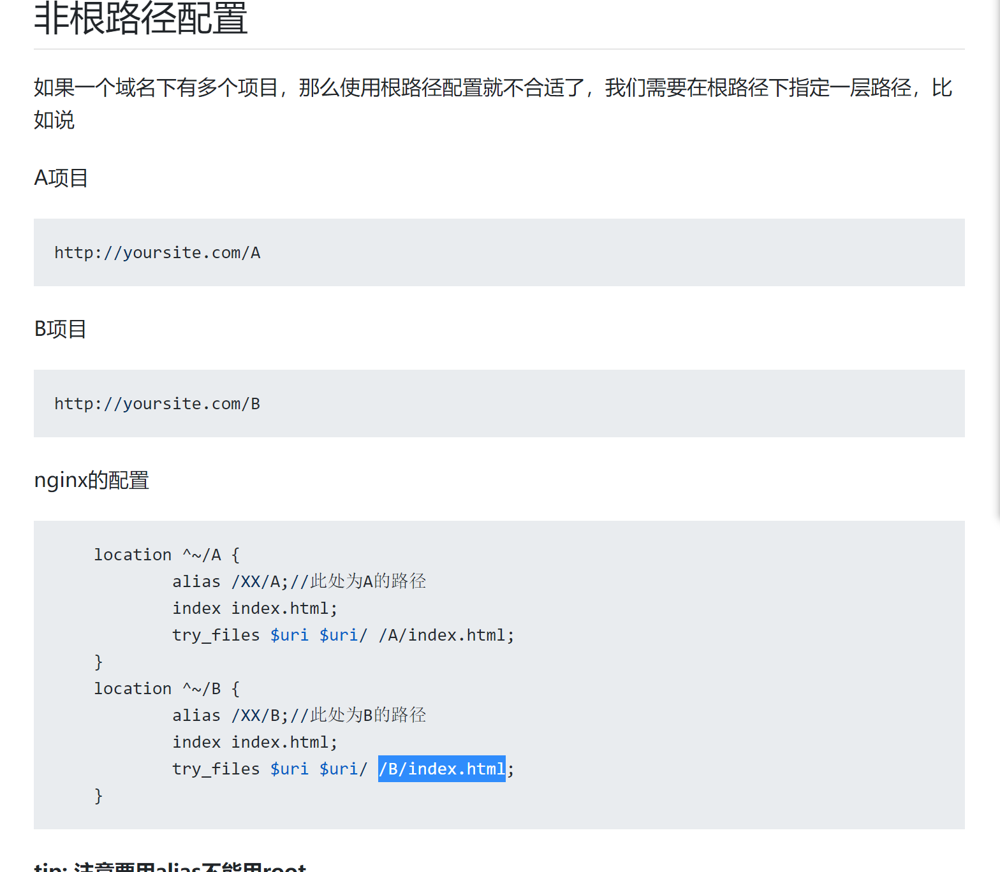

# nginx配置
- nginx常用命令

   systemctl status nginx

   systemctl reload nginx

   whereis nginx 查看安装路径
   
   cat /var/log/nginx/error.log


- root和alias的区别
alias是一个目录别名的定义，root则是最上层目录的定义.<br>
一直以为root是指的/var/www/image目录下，应该是/var/www/image/img/ <br>
还有一个重要的区别是alias后面必须要用 `/` 结束，否则会找不到文件的.  而root则可有可无~~
```
// 访问/img/目录里面的文件时，ningx会自动去/var/www/image/目录找文件
location /img/ {
    alias /var/www/image/;
}

// 访问/img/目录下的文件时，nginx会去/var/www/image/img/目录下找文件
location /img/ {
    root /var/www/image;
}
```

- 对于index，含义如下

```
  location / {
        root /var/www/;
        index index.htm index.html;
  }
```

这样，当用户请求 `/` 地址时，Nginx 就会自动在 root 配置指令指定的文件系统目录下依次寻找 `index.htm` 和`index.html` 这两个文件。如果 `index.htm` 文件存在，则直接发起“内部跳转”到 `/index.htm` 这个新的地址；而如果 `index.htm` 文件不存在，则继续检查 `index.html` 是否存在。如果存在，同样发起“内部跳转”到`/index.html`；如果 `index.html` 文件仍然不存在，则放弃处理权给 `content` 阶段的下一个模块

- alias的配置
如果webpack/vue-cli 的publicPath,或者vite的base ,为 "/myBase", 则所有引用路径会加上/myBase 。
假如把dist文件夹放在了服务器的 `/test/vue/dist/` 文件夹，nginx 的 location 可以这样配：

```
location /myBase {
    alias /test/vue/dist/;
    index index.html;
}
```


- 同个域名多个项目配置




```
# nginx配置
location / {
  # 不缓存html，防止程序更新后缓存继续生效
  if ($request_filename ~* .*\.(?:htm|html)$) {
    add_header Cache-Control "private, no-store, no-cache, must-revalidate, proxy-revalidate";
    access_log on;
  }
  # 这里是vue打包文件dist内的文件的存放路径
  root   /srv/www/project/;
  index  index.html index.htm;
}
```

### location匹配规则

形式如下：

``location [ = | ~ | ~* | ^~ ] uri { ... }``

- **none**，如果没有修饰符，则将该位置解释为前缀匹配。这意味着给定的位置将根据请求URI的开头进行匹配，以确定匹配
- `=`，代表精确匹配，完全相等即匹配
- `~`，区分大小写的正则表达式匹配
- `~*`，不区分大小写的正则表达式匹配
- `^~`，普通字符匹配，如果该选项匹配，只匹配该选项
- `/` 通用匹配, 如果没有其它匹配,任何请求都会匹配到

匹配步骤如下：

1. 精确匹配 =，如果匹配成功，搜索停止
2. 前缀匹配，最长位置匹配，如果该匹配具有 ^~，搜索停止
3. .正则匹配，按配置文件中定义的顺序进行匹配。
4. 如果第 3 条规则产生匹配的话，结果被使用。否则，使用第 2 条规则的结果。


```js
server {
    listen 12080;
    server_name abc.com;

    access_log  /var/log/nginx/test.access.log;
    error_log   /var/log/nginx/test.error.log;

    location ~* \.png$ {
        return 402;
    }

    location / {
        return 400;
    }

    location /static/js/css/ {
        return 405;
    }

    location ^~ /static/ {
        return 401;
    }

    location ^~ /static/js/ {
        return 404;
    }

    location = /static/abc.png {
        return 403;
    }
}
```

解答：

/static/js/css/4.png 返回 402

```js
405 、401 、404 这三个都属于前缀模式匹配。/static/js/css/4.png 同时匹配到了这三个前缀模式，当同时匹配到多个前缀模式时，需要按最长匹配规则进行选取，即最终会命中 405 。
而 405 没有阻止继续匹配正则(既没有^~, 搜索不会停止)，所以会继续匹配正则模式，而正则模式就是 402 那个，所以会返回 402
```

/static/js/4.png 返回 404

/static/js/css6/4.png  返回 404

https://www.v2ex.com/t/1002226

https://nginx.viraptor.info/
