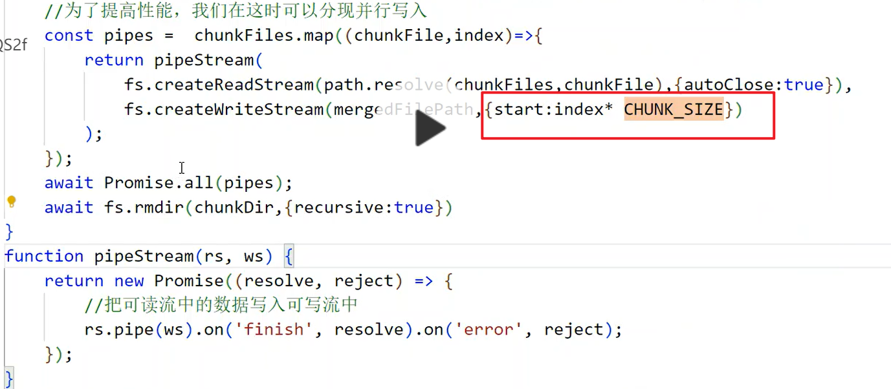

https://juejin.cn/post/6844904046436843527#heading-19

- 获取数组的最后一个元素： at(-1)

- 数组与对象的相互转换

  ```js
  对象到数组: Object.entries()
  数组到对象: Object.fromEntries()
  ```


- 本地文件预览

  createObjectUrl 

- 文件秒传

  服务器已经存有一份了，不需要再次上传。这个文件的文件名由文件内容hash而成。

  需要服务器提供一个接口，返回已经上传的分片和大小。

- 切片上传

  1.获取arrayBuffer : blob.arrayBuffer()  或者 fileReader.readAsArrayBuffer()

  利用浏览器提供的web cryptography api,  它用于计算传入数据的sha-256 算法。

  2.计算哈希：await  crypto.subtle.digest('SHA-256',arrayBuffer)

  计算文件内容的hash会很慢，可以用worker，防止耗时操作阻塞UI线程

  3.得到文件名之后，就可以处理切片了

- 切片数量的动态调整

- content-type的application/octet-stream 和 form-data区别

  用字节流的话只能上传二进制文件

  如果用formData的话可以同时上传文件和普通字段

- 并行写入

  利用可写流可以指定写入位置



- 暂停上传

  控制上传的状态：未上传，上传中，已暂停

  存放所有上传请求的cancel token

  调用cancel方法，axios会抛出错误，在try catch里面用isCancel方法判断是否为用户取消暂停的而导致的异常

- 恢复上传（即断点续传）

  服务端需要提供一个接口，获取每个分片上传了多少，以便客户端上传分片剩下的部分

  const remainingChunk = file.slice(uploadedSize)

  如果remainingChunk.size==0 则表示已经上传完成，直接resolve即可

​		断点续传还需要给接口传 分片的起始索引，用于服务端给分片的写入位置

- worker

  与主线程隔离，有自己的全局上下文，不能访问dom, window

- 控制并发上传的数量

  ```js
  <!DOCTYPE html>
  <html lang="en">
  <head>
    <meta charset="UTF-8">
    <meta name="viewport" content="width=device-width, initial-scale=1.0">
    <title>File Upload Demo</title>
  </head>
  <body>
  
  <input type="file" id="fileInput" />
  <button onclick="startUpload()">Start Upload</button>
  
  <script>
  // Mock function to simulate uploading a file chunk
  function uploadChunk(chunk) {
    return new Promise(resolve => {
      // Simulate asynchronous upload
      setTimeout(() => {
        console.log(`Uploaded chunk: ${chunk}`);
        resolve();
      }, Math.random() * 1000); // Simulating network latency
    });
  }
  
  // Function to handle file upload
  async function startUpload() {
    const fileInput = document.getElementById('fileInput');
    const file = fileInput.files[0];
  
    const chunkSize = 1024 * 1024; // 1 MB chunk size
    const totalChunks = Math.ceil(file.size / chunkSize);
    const concurrencyLimit = 5; // Maximum concurrent uploads
  
    let uploadedChunks = 0;
  
    async function uploadNextChunk() {
      if (uploadedChunks >= totalChunks) {
        console.log('Upload completed');
        return;
      }
  
      const start = currentChunk * chunkSize;
      const end = Math.min((currentChunk + 1) * chunkSize, file.size);
      const chunk = file.slice(start, end);
  
      console.log(`Uploading chunk ${currentChunk + 1}/${totalChunks}`);
  
      // Simulate upload and wait for it to complete
      await uploadChunk(chunk);
  
      uploadedChunks++;
      // Upload the next chunk
      uploadNextChunk();
    }
  
    // Start initial uploads (up to the concurrency limit)
    const initialUploads = Math.min(totalChunks, concurrencyLimit);
    for (let i = 0; i < initialUploads; i++) {
      uploadNextChunk();
    }
  }
  
  </script>
  
  </body>
  </html>
  
  ```

  
