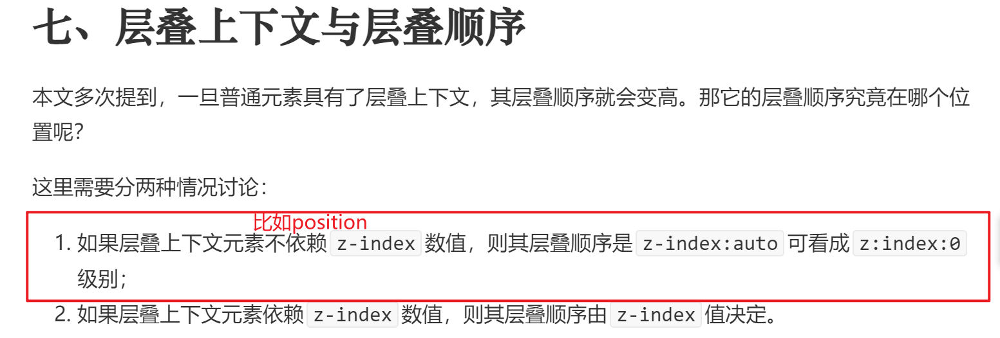
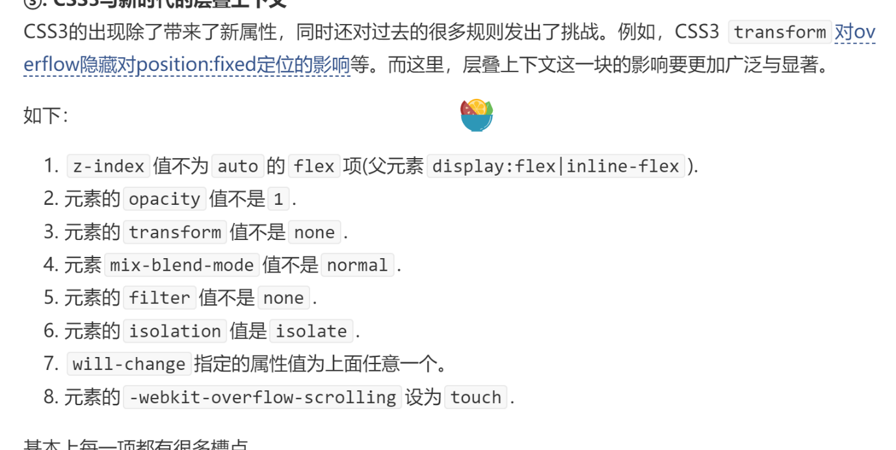

### 什么是从父原则:

1. 子元素在与父辈元素比较的时候，用父辈的 z-index 去比较
2. 在与同级元素比较的时候，才有自己的 z-index 去比较

### 什么情况下出现从父原则

1. 父元素通过`fixed absolute relative`定位的元素, 子元素也是`fixed absolute relative`定位的元素。
2. 在父元素上设置了`z-index`
3. 跟父元素同级的元素也是通过`fixed absolute relative`定位的元素，并且设定了`z-index`

[引用](https://obkoro1.com/web_accumulate/codeBlack/fixed%E7%9A%84%E4%BB%8E%E7%88%B6%E5%8E%9F%E5%88%99.html#%E4%BB%A3%E7%A0%81%EF%BC%9A)

### 产生层叠上下文一般有3种方法：

1. `HTML`中的根元素`<html></html>`本身j就具有层叠上下文，称为“根层叠上下文”。
2. 普通元素设置`position`属性为**非**`static`值并设置`z-index`属性为具体数值，产生层叠上下文。
3. CSS3中的新属性也可以产生层叠上下文。

[引用](https://juejin.cn/post/6844903667175260174)

### 创建层叠上下文

1. `HTML`中的根元素`<html></html>`本身j就具有层叠上下文，称为“根层叠上下文”
2. `position` 属性为 `relative` 或 `absolute`（**并设置`z-index`属性**）
3. `position` 属性为 `fixed` 或 `sticky` （无需 z-index 直接产生上下文）
4. `opacity` 小于 `1`
5. [`mix-blend-mode`](https://link.juejin.cn?target=https%3A%2F%2Fdeveloper.mozilla.org%2Fzh-CN%2Fdocs%2FWeb%2FCSS%2Fmix-blend-mode) 不为 `normal`
6. `display: flex` 或 `display: grid` （**并给子元素设置`z-index`属性**）
7. 使用`transform`, `filter`, `clip-path`, 或`perspective`
8. `will-change` 值为 `opacity` 或 `transform`

[张鑫旭](https://www.zhangxinxu.com/wordpress/2016/01/understand-css-stacking-context-order-z-index/)

