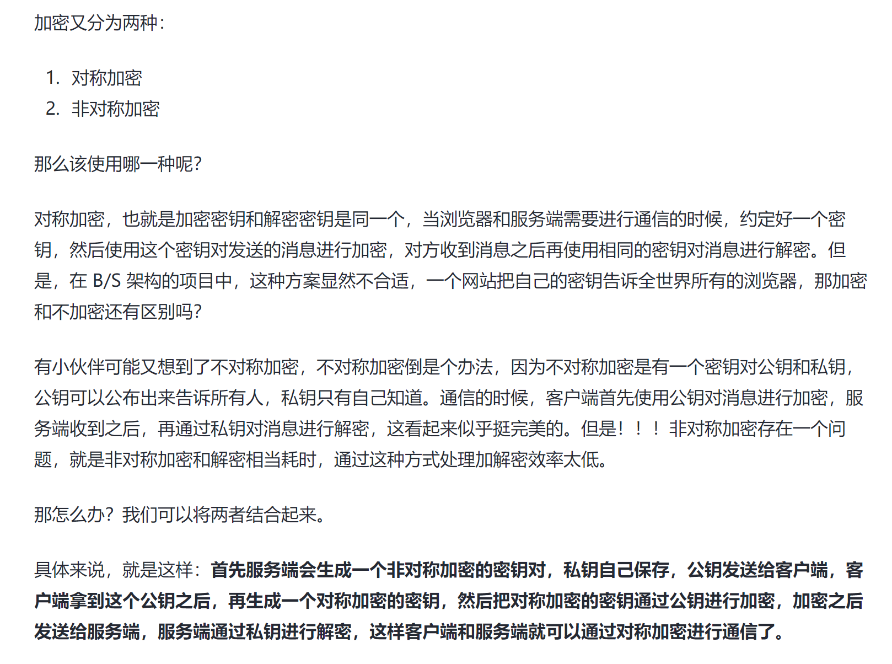

对称加密中，我们只需要一个密钥，通信双方同时持有。而非对称加密需要4个密钥。通信双方各自准备一对公钥和私钥。其中公钥是公开的，由信息接受方提供给信息发送方。公钥用来对信息加密。私钥由信息接受方保留，用来解密。既然公钥是公开的，就不存在保密问题。也就是说非对称加密完全不存在密钥配送问题！你看，是不是完美解决了密钥配送问题？

回到刚才的例子，小明和下红经过研究发现非对称加密能解决他们通信的安全问题，于是做了下面的事情：

1、小明确定了自己的私钥 mPrivateKey，公钥 mPublicKey。自己保留私钥，将公钥mPublicKey发给了小红

2、小红确定了自己的私钥 hPrivateKey，公钥 hPublicKey。自己保留私钥，将公钥 hPublicKey 发给了小明

3、小明发送信息 “周六早10点soho T1楼下见”，并且用小红的公钥 hPublicKey 进行加密。

4、小红收到信息后用自己的私钥 hPrivateKey 进行解密。然后回复 “收到，不要迟到” 并用小明的公钥mPublicKey加密。

5、小明收到信息后用自己的私钥 mPrivateKey 进行解密。读取信息后心里暗想：还提醒我不迟到？每次迟到的都是你吧？

以上过程是一次完整的request和response。通过这个例子我们梳理出一次信息传输的非对称加、解密过程：

1、消息接收方准备好公钥和私钥

2、私钥接收方自己留存、公钥发布给消息发送方

3、消息发送方使用接收方公钥对消息进行加密

4、消息接收方用自己的私钥对消息解密

公钥只能用做数据加密。公钥加密的数据，只能用对应的私钥才能解密。这是非对称加密的核心概念。

- https://zhuanlan.zhihu.com/p/436455172

- **使用非对称加密传输一个对称密钥K，让服务器和客户端都得知。然后两边都使用这个对称密钥K来加密解密收发数据。因为传输密钥K是用非对称加密方式，很难破解比较安全。而具体传输数据则是用对称加密方式**
- https://icodebook.com/posts/crypt-cert
- https://github.com/febobo/web-interview/issues/134

- https://www.51cto.com/article/628890.html

服务端将数字签名发给浏览器，浏览器利用系统已经内置的公钥验签，确认签名没问题，然后就提取出来数字签名中的公钥，开始协商对称加密的私钥了～

### 对称加密的所用的密钥是如何获取的？

在 HTTPS 中，对称加密的密钥并不是公开的，而是通过一种称为"握手"（handshake）的过程动态生成的。在握手过程中，客户端和服务器之间会协商一个对称密钥，该密钥随后用于加密和解密传输的数据。

以下是简要的 HTTPS 握手过程：

1. **客户端发送请求：** 客户端向服务器发起连接请求，并请求建立一个安全的连接。
2. **服务器响应：** 服务器收到客户端请求后，返回一个包含数字证书的响应。
3. **客户端验证证书：** 客户端验证服务器提供的数字证书的合法性。这包括检查证书是否由受信任的证书颁发机构（CA）签发，是否没有过期等。
4. **生成对称密钥：** 如果数字证书验证成功，客户端会生成一个随机的对称密钥，用于加密后续的通信。
5. **使用公钥加密对称密钥：** 客户端使用服务器的公钥（从服务器的数字证书中提取）加密生成的对称密钥，然后将加密后的对称密钥发送给服务器。
6. **服务器使用私钥解密：** 服务器使用自己的私钥解密客户端发送的加密对称密钥。
7. **建立安全连接：** 双方现在都拥有相同的对称密钥，该密钥用于加密和解密在安全连接上发送的数据。

整个握手过程确保了通信双方能够安全地协商出一个用于对称加密的密钥，而这个过程中涉及的公钥和私钥主要用于数字证书的验证和对称密钥的安全传递。

- 客户端(浏览器)向服务端发出请求，服务端返回证书给客户端。
- 客户端拿到证书后，把证书里的签名与及明文信息分别取出来，然后会用自身携带的CA机构的公钥去解密签名，得到信息摘要1，然后再对明文信息进行HASH，得到一个信息摘要2，对比信息摘要1 和信息摘要2，如果一样，说明证书是合法的，也就是证书里的公钥是正确的。

### 验证数字签名的有效性通常包括以下步骤：

接收者使用获得的公钥对接收到的信息进行解密，然后比对解密后的结果与原始信息进行比对，如果一致，就说明数字签名有效。

1. **获取公钥：** 获取数字签名的对应公钥。这通常涉及到从证书中提取公钥，或者从密钥管理系统中获取。
2. **提取签名和原始数据：** 从数字签名中提取签名值和原始数据。
3. **使用公钥验证签名：** 使用相应的公钥对原始数据进行解密，得到解密后的摘要。
4. **生成原始数据的摘要：** 对原始数据进行相同的哈希算法，生成摘要。
5. **比较摘要值：** 比较解密后的摘要和生成的摘要。如果两者匹配，则数字签名有效。

这个过程利用了非对称加密的原理。数字签名是由私钥生成的，而验证过程使用对应的公钥。数字签名的解密过程实际上是对比原始数据的哈希摘要和签名中的摘要，如果一致，说明数字签名有效。
